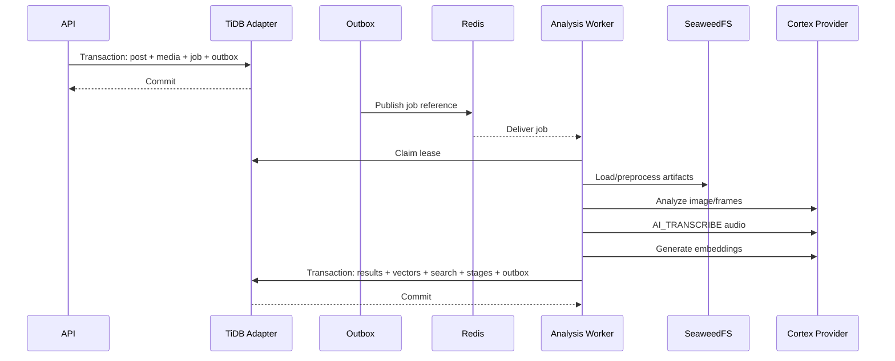

# Design Document: Analysis Integration Contract

## Overview

This specification defines the integration layer between Snowflake Cortex media analysis and application persistence/search. It owns the versioned analysis-job and result contracts, processing orchestration, queue interaction, leases, idempotency, stage transitions, atomic persistence sequencing, feature flags, and end-to-end behavior.

The integration layer does not implement Cortex function calls or database-specific repositories. It consumes `CortexAnalysisProvider` and persistence/search contracts while producing one reliable capture-to-analysis-to-search workflow.

## Architecture



## Components and Interfaces

```pascal
INTERFACE AnalysisCoordinator
  enqueue(request: AnalysisJobRequest): Promise<JobReceipt>
  process(jobId: UUID): Promise<AnalysisCompletion>
  persistResults(completion: AnalysisCompletion): Promise<Void>
END INTERFACE

INTERFACE CortexAnalysisProvider
  analyzeImage(input: ImageAnalysisInput): Promise<ImageAnalysisResult>
  analyzeFrame(input: FrameAnalysisInput): Promise<FrameAnalysisResult>
  transcribeAudio(input: AudioTranscriptionInput): Promise<TranscriptResult>
  generateTextEmbedding(input: EmbeddingInput): Promise<EmbeddingResult>
  generateMultimodalEmbedding(input: MultimodalEmbeddingInput): Promise<EmbeddingResult>
END INTERFACE

INTERFACE TiDBIntegrationPort
  createCaptureTransaction(input: CaptureInput): Promise<JobReceipt>
  claimLease(jobId: UUID, workerId: String): Promise<JobLease>
  loadJobContext(jobId: UUID): Promise<JobContext>
  persistCompletion(completion: AnalysisCompletion, lease: JobLease): Promise<Void>
  markFailure(failure: ClassifiedFailure, lease: JobLease): Promise<Void>
END INTERFACE
```

## Shared data models

```pascal
STRUCTURE AnalysisJobRequest
  jobId: UUID
  ownerId: UUID
  postId: UUID
  mediaAssetIds: List<UUID>
  requestedStages: List<AnalysisStage>
  idempotencyKey: String
  schemaVersion: Integer
END STRUCTURE

STRUCTURE AnalysisResultEnvelope
  schemaVersion: Integer
  jobId: UUID
  postId: UUID
  mediaAssetId: UUID OR NULL
  provider: String
  providerModel: String
  providerModelVersion: String OR NULL
  idempotencyKey: String
  status: ResultStatus
  caption: String OR NULL
  tags: List<TagResult>
  frameResults: List<FrameResult>
  transcript: TranscriptResult OR NULL
  textEmbedding: EmbeddingResult OR NULL
  multimodalEmbedding: EmbeddingResult OR NULL
  rawProviderResult: JSON OR NULL
  warnings: List<String>
  startedAt: Timestamp
  completedAt: Timestamp OR NULL
END STRUCTURE

STRUCTURE AnalysisCompletion
  jobId: UUID
  leaseVersion: Integer
  results: List<AnalysisResultEnvelope>
  completedStages: List<StageState>
  failedStages: List<ClassifiedFailure>
  searchDocument: SearchDocument OR NULL
  completionIdempotencyKey: String
END STRUCTURE
```

## Workflow design

### Capture

1. Validate owner scope and canonical URL.
2. Begin TiDB transaction through the TiDB integration port.
3. Insert post, idempotency record, media metadata, analysis job, and initial outbox event.
4. Commit before returning success.
5. Outbox publisher sends the job reference to Redis.

### Processing

1. Worker receives job ID.
2. TiDB atomically assigns a lease.
3. Worker loads job context and media references.
4. Worker preprocesses media through FFmpeg and SeaweedFS.
5. Worker invokes provider stages independently.
6. Worker assembles normalized result envelopes.
7. Worker persists all successful results and search state in one TiDB transaction guarded by lease version.
8. Worker commits completion outbox event.
9. Worker acknowledges queue message only after commit or durable terminal failure.

### Retry

- Transient provider, object-store, queue, and TiDB errors are retryable within configured bounds.
- Capability, permission, malformed-input, and permanent-content errors are terminal until an explicit operator/configuration change.
- Replayed messages use idempotency keys and result identity to avoid duplicates.
- Lease expiry permits reclaim; stale workers cannot commit.

## Transaction boundary

External calls never run inside a TiDB transaction. Persistence transaction includes:

- Normalized analysis results.
- Transcript and segment rows.
- New embedding versions and active embedding selection.
- Search document upsert/delete.
- Stage state updates.
- Job status and attempt metadata.
- Completion outbox event.

## Error handling

- `STALE_LEASE`: worker result rejected; worker reloads job and exits without overwriting newer state.
- `DUPLICATE_COMPLETION`: existing result identity returned; no duplicate rows created.
- `RETRYABLE_STAGE_FAILURE`: stage remains retryable and job is returned to queue.
- `TERMINAL_STAGE_FAILURE`: stage records classified failure; independent stages may complete.
- `PERSISTENCE_FAILURE`: transaction rolls back; queue message remains retryable.
- `PARTIAL_MEDIA_FAILURE`: valid media stages proceed; failed stages retain explicit status.

## Correctness properties

1. Every capture acknowledgement follows a committed job and outbox event.
2. Every successful completion is persisted atomically or not at all.
3. Replaying a completion with the same completion idempotency key creates no duplicate state.
4. A worker without the current lease version cannot commit stage changes.
5. Independent stage failures do not erase successful stage results.
6. Queue acknowledgement occurs only after durable commit or durable terminal failure.
7. Every search document derives from the same committed current result state.
8. Every completion envelope can be consumed by TiDB without provider-specific parsing.

## Testing strategy

- Contract tests for shared types and schema versions.
- Coordinator unit tests with fake provider, fake TiDB port, fake object store, and fake queue.
- Transaction sequencing tests.
- Duplicate delivery and duplicate completion tests.
- Lease expiry and stale-worker tests.
- Crash-before-commit and crash-after-commit tests.
- Partial-stage failure tests.
- End-to-end tests with real TiDB adapter, real/fake Cortex provider, Redis, and SeaweedFS fixtures.
- Property tests for idempotency, stage-state monotonicity, score/document consistency, and envelope round trips.

## Performance considerations

- Bound worker concurrency and per-stage provider concurrency.
- Avoid holding database transactions during Cortex or object-store calls.
- Batch persistence of independent stage results where safe.
- Keep completion payloads below configured database limits.
- Use outbox polling indexes and bounded queue message visibility timeouts.

## Security considerations

- Validate authenticated owner scope before job creation and processing.
- Never trust owner IDs from queue payloads without loading the TiDB job.
- Use signed/controlled media access.
- Redact provider responses and media references from logs.
- Reject cross-owner job/result identifiers.

## Dependencies

- Snowflake Cortex provider contract from `snowflake-cortex-media-analysis`.
- Persistence and search repository contracts.
- Redis queue and outbox publisher.
- SeaweedFS object storage.
- FFmpeg media preprocessor.
- Existing Elysia API and domain modules.

## Integration acceptance criteria

The integration is complete only when a capture can travel through committed TiDB job creation, outbox publication, lease acquisition, media preprocessing, Cortex image/frame analysis, Cortex `AI_TRANSCRIBE`, Cortex embeddings, atomic TiDB result/search persistence, and owner-scoped search without duplicate rows after message replay.
