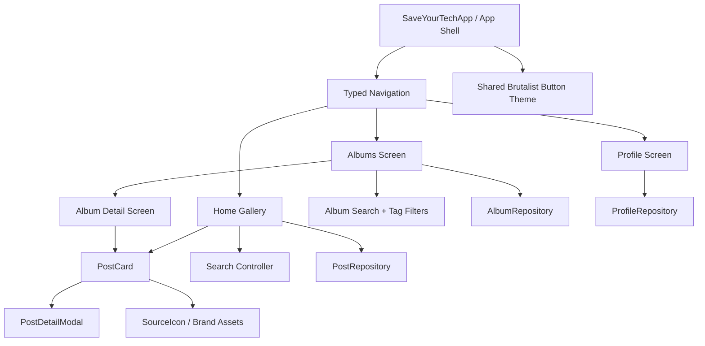

# Design Document: Archive, Profile, and Modal UI Refresh

## Overview

This feature extends the existing Flutter client with polished mockups and interaction contracts for Albums, Album Detail, and Profile while bringing the current shell into alignment with the neobrutalist visual system. It also standardizes controls, replaces text-based source indicators with recognizable brand logos, and changes post-card activation from any pull-down/menu treatment to an explicit modal detail surface.

The implementation should preserve the current adaptive Flutter architecture, repository boundary, `PostCard`/`PostDetailModal` widgets, and visual tokens in `DESIGN.md`. Albums and profile initially use repository-backed mock data so the screens can be reviewed end-to-end without requiring new backend endpoints; interfaces should leave room for real API providers later. The result is a navigable product mockup rather than a static image: users can browse album groups, search and filter posts, open a post modal, inspect profile statistics, and access account actions.

## Architecture

The app remains a single Flutter client with a presentation layer over repository/service interfaces. Navigation state is promoted from the current integer tab to typed destinations, while each destination owns its screen-level query/filter state. Shared visual primitives enforce the button, surface, logo, and modal contracts.



### Navigation and responsive behavior

- Mobile keeps the three-item bottom navigation: Home, Albums, Profile.
- Wide layouts use the persistent navigation rail and the same destinations.
- Album selection pushes or replaces the Albums destination with Album Detail while retaining a visible back affordance.
- A post card always opens `PostDetailModal.show`; on narrow screens this is a modal bottom sheet with a drag handle, and on wide screens it is a centered dialog/inspector. It is never an unlabeled pull-down menu.
- Search is contextual to Home and Albums. The top-bar Search button focuses or opens the relevant search field rather than creating a second inconsistent search surface.

## Components and Interfaces

### Component 1: `BrutalistButton`

**Purpose**: Provide one visual and interaction contract for all buttons, including the search button that currently violates the system.

**Interface**:

```dart
enum BrutalistButtonVariant { primary, secondary, destructive }

class BrutalistButton extends StatelessWidget {
  const BrutalistButton({
    super.key,
    required this.label,
    required this.onPressed,
    this.icon,
    this.variant = BrutalistButtonVariant.secondary,
    this.tooltip,
  });

  final String label;
  final VoidCallback? onPressed;
  final Widget? icon;
  final BrutalistButtonVariant variant;
  final String? tooltip;
}
```

**Responsibilities**:

- Render a square shape with slight rounding (`5px` equivalent), 2px black border, and 4px hard offset shadow.
- Maintain a minimum 44 logical pixel hit target.
- Apply pressed translation `(2, 2)` and a 2px pressed shadow.
- Expose semantic labels/tooltips and visible focus treatment.
- Replace ad hoc `FilledButton` styling in the app bar, dialogs, profile actions, and album controls.

### Component 2: `SourceIcon`

**Purpose**: Show an actual source-platform logo rather than platform text.

**Interface**:

```dart
class SourceIcon extends StatelessWidget {
  const SourceIcon({
    super.key,
    required this.source,
    this.size = 20,
    this.showLabel = false,
  });

  final PostSource source;
  final double size;
  final bool showLabel;
}
```

**Responsibilities**:

- Map supported sources (Instagram, Reddit, TikTok, Facebook, X, and unknown/web) to bundled SVG brand assets or a clearly documented icon fallback.
- Preserve accessible text such as `Instagram source` even when only the logo is visible.
- Keep logos inside a stable square footprint so card metadata does not jump between platforms.
- Do not use a generic text abbreviation as the primary visual representation.

### Component 3: `AlbumsPage`

**Purpose**: Present the user’s album groups and their search/filter affordances.

**Interface**:

```dart
class AlbumsPage extends StatefulWidget {
  const AlbumsPage({super.key, required this.repository});
  final AlbumRepository repository;
}

abstract interface class AlbumRepository {
  Future<List<Album>> listAlbums({String query = '', Set<String> tags = const {}});
  Future<AlbumDetail> getAlbum(String albumId);
}
```

**Responsibilities**:

- Render album cover mockups with title, post count, updated date, and visibility.
- Provide a square search control and a search field that filters albums and/or tags.
- Show tag chips as secondary filters, with clear-all behavior.
- Provide loading, empty, error, and no-results states.
- Open `AlbumDetailPage` on album activation.

### Component 4: `AlbumDetailPage`

**Purpose**: Show a selected group of posts in the same gallery language as Home.

**Interface**:

```dart
class AlbumDetailPage extends StatefulWidget {
  const AlbumDetailPage({super.key, required this.albumId, required this.repository});
  final String albumId;
  final AlbumRepository repository;
}
```

**Responsibilities**:

- Render an album header with back, rename, share, and organization controls.
- Show the album’s posts in a responsive staggered/gallery layout using `PostCard`.
- Support automatic tag grouping/sorting through a selected sort mode (`recent`, `source`, `tag`) while preserving manual clear labeling.
- Search within the album and display the active query/filter state.
- Open each post using the shared modal detail surface, not an inline expansion or menu.
- Keep source logo, capture age, status, and album membership visible in card metadata.

### Component 5: `ProfilePage`

**Purpose**: Provide a mock profile/account-management surface with useful archive statistics.

**Interface**:

```dart
class ProfilePage extends StatelessWidget {
  const ProfilePage({super.key, required this.repository});
  final ProfileRepository repository;
}

abstract interface class ProfileRepository {
  Future<UserProfile> getProfile();
  Future<void> logOut();
}
```

**Responsibilities**:

- Display a large completely round profile image with a neobrutalist black border and hard drop shadow.
- Show display name, username, and account identity below/adjacent to the image based on available width.
- Show stats useful to this application: total saved posts, albums, source platforms, and tags.
- Provide labeled account actions, including Log out; future settings/export/delete actions may share the same section.
- Provide loading and failure states without removing the navigation shell.
- Never make logout or account management gesture-only.

### Component 6: `PostDetailModal`

**Purpose**: Establish one explicit modal behavior for all card activation paths.

**Interface**:

```dart
abstract final class PostDetailModal {
  static Future<T?> show<T>(
    BuildContext context, {
    required SavedPost post,
    Future<void> Function()? onDelete,
    Future<void> Function(String album)? onRemoveFromAlbum,
  });
}
```

**Responsibilities**:

- Use a true modal route with barrier, focus management, escape/back dismissal, and restoration of focus to the triggering card.
- Use a bottom-sheet presentation on mobile and centered modal/inspector on wide layouts.
- Present media, source link/logo, generated description, tags, provenance/status, and labeled actions in that order.
- Keep destructive actions explicit and confirmable.
- Ensure the card itself does not expose a pull-down menu as its primary interaction.

## Data Models

### Model 1: `Album`

```dart
class Album {
  const Album({
    required this.id,
    required this.name,
    required this.coverPost,
    required this.postCount,
    required this.tags,
    required this.updatedAt,
    required this.visibility,
  });

  final String id;
  final String name;
  final SavedPost? coverPost;
  final int postCount;
  final Set<String> tags;
  final DateTime updatedAt;
  final AlbumVisibility visibility;
}

enum AlbumVisibility { private, public }
```

**Validation Rules**:

- `id` and `name` must be non-empty.
- `postCount` cannot be negative.
- Tags are normalized for case-insensitive matching and displayed in a stable order.
- Private albums must not be exposed through public album links.

### Model 2: `AlbumDetail`

```dart
class AlbumDetail {
  const AlbumDetail({required this.album, required this.posts});
  final Album album;
  final List<SavedPost> posts;
}

enum AlbumSort { recent, source, tag }
```

**Validation Rules**:

- Every post shown in detail must belong to the requested album in repository data.
- Sorting is deterministic: ties fall back to post capture time, then ID.
- Search matches title, excerpt, source, and normalized tags.

### Model 3: `UserProfile`

```dart
class UserProfile {
  const UserProfile({
    required this.displayName,
    required this.username,
    required this.avatarUrl,
    required this.savedPostCount,
    required this.albumCount,
    required this.sourceCount,
    required this.tagCount,
  });

  final String displayName;
  final String username;
  final String? avatarUrl;
  final int savedPostCount;
  final int albumCount;
  final int sourceCount;
  final int tagCount;
}
```

**Validation Rules**:

- Display name and username are non-empty.
- All counts are zero or greater.
- Avatar failure falls back to an accessible initials avatar while retaining the circular shape and shadow.

### Model 4: `BrandAsset`

```dart
class BrandAsset {
  const BrandAsset({required this.source, required this.assetPath, required this.label});
  final PostSource source;
  final String assetPath;
  final String label;
}
```

**Validation Rules**:

- Every supported `PostSource` has a deterministic asset or documented fallback.
- Asset paths must be declared in `pubspec.yaml` and load successfully in tests/build.

## Error Handling

### Repository load failure

**Condition**: Album or profile data cannot be loaded.
**Response**: Preserve the app shell and show a bordered failure surface with a plain-language message and labeled Retry button.
**Recovery**: Retry the same request; do not discard already loaded data when refreshing.

### Search returns no matches

**Condition**: Query and filters produce no albums or posts.
**Response**: Show a no-results state with the active query, Clear filters, and a suggestion to search tags or source names.
**Recovery**: Clear query/filters or modify the query without leaving the screen.

### Missing brand asset

**Condition**: A logo asset is unavailable or fails to decode.
**Response**: Render a stable accessible fallback icon plus source label; do not show broken-image UI.
**Recovery**: Log the asset failure and continue rendering the card.

### Logout failure

**Condition**: Account logout request fails.
**Response**: Keep the user on Profile and show an error snackbar/surface with Retry.
**Recovery**: Retry logout; do not imply that the session ended until the repository confirms it.

### Modal action failure

**Condition**: Delete/remove-from-album fails from the post modal.
**Response**: Keep the modal open, preserve content, and show a labeled error with Retry.
**Recovery**: Retry the action or dismiss without losing the post context.

## Testing Strategy

### Unit Testing Approach

- Test button theme/style contracts: 5px radius, 2px border, hard shadow, minimum hit target, and variant colors.
- Test album filtering by title, source, excerpt, and tags; verify case-insensitive matching.
- Test deterministic `recent`, `source`, and `tag` sorting, including ties.
- Test profile statistic mapping and non-negative validation.
- Test source-to-brand-asset mapping and accessible fallback behavior.
- Test modal action callbacks, cancellation, and error preservation.

### Property-Based Testing Approach

**Property Test Library**: `glados` or a lightweight `fast_check`-compatible Dart property-testing package, subject to package availability; if no suitable package is approved, encode the same properties as parameterized Flutter tests.

Properties:

- Filtering a list with an empty query returns the same set of items.
- Filtering is case-insensitive and never returns an item that matches none of the searchable fields.
- Sorting preserves the multiset of posts and is deterministic for identical input.
- Any generated non-negative profile counts remain non-negative after presentation mapping.
- Every supported source resolves to either a valid brand asset or the documented fallback.

### Integration Testing Approach

- Pump the app at mobile and wide breakpoints and verify Home, Albums, Album Detail, and Profile are reachable through navigation.
- Tap a post card and verify a modal route/barrier appears; verify back, escape, and close restore the originating surface.
- Search an album, choose a tag, and verify the visible posts update without leaving Album Detail.
- Verify the profile avatar is circular and the logout control is visible and labeled.
- Verify source logos render in post cards and modal metadata.
- Verify keyboard traversal and semantic labels for search, navigation, modal close, destructive actions, and logout.

## Performance Considerations

- Debounce album/post search to avoid a repository request per keystroke; retain the current result set during loading.
- Use lazy slivers/grids for album and post collections and cache cover thumbnails.
- Bundle only the small SVG brand assets needed by supported platforms.
- Avoid rebuilding the full app shell when only search, sort, or modal state changes.
- Use a stable modal route rather than rebuilding card lists during modal animation.

## Security Considerations

- Do not display private album data in public routes or public mockups.
- Keep account actions behind the authenticated profile state and route logout through the existing auth service.
- Treat source URLs and generated post content as untrusted text; do not render raw HTML or executable content.
- Do not log access tokens, private profile data, or private album identifiers.
- Brand SVGs must be local, reviewed assets; do not load arbitrary remote SVG markup.

## Dependencies

- Existing Flutter SDK and Material 3 foundation.
- Existing `flutter_svg` dependency for bundled platform logos.
- Existing `go_router` dependency, if promoted from the current home-only shell to typed screen routes.
- Existing `flutter_riverpod` dependency for repository/provider state where appropriate.
- Existing `http` and secure storage services for future real profile/album API integration.
- New local SVG assets for supported social platforms, with attribution/licensing documented in the repository.
- No new backend service is required for the initial mockup; implement repository interfaces with mock data first.
