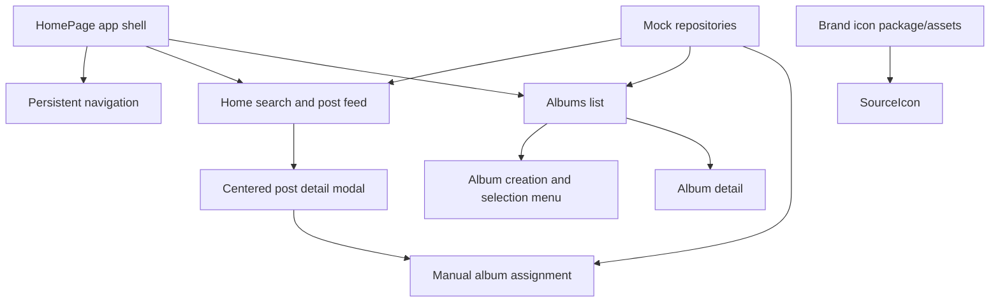

# Design Document: Archive and Profile UI Enhancements

## Overview

This feature extends the existing Flutter/neobrutalist archive UI with reviewed brand icons, manual album assignment, a home-only search action, a mock search menu, and album creation/selection interactions. The implementation preserves the existing repository-backed mock architecture and reusable modal/card components.

All navigation remains owned by the application shell so nested screens do not replace Home/Albums/Profile navigation. Saved-post detail is presented as a centered neobrutalist modal with a hard shadow, while album actions use explicit touch targets and contextual controls.

## Architecture



## Components and Interfaces

### Component 1: BrandIconProvider

**Purpose**: Resolve platform names to reviewed brand icons from a maintained package or bundled asset adapter.

**Interface**:

```dart
abstract interface class BrandIconProvider {
  Widget icon(String platform, {double size = 24});
  String accessibleLabel(String platform);
}
```

**Responsibilities**:

- Use a pub package for supported social brand marks.
- Keep icon mapping centralized in `SourceIcon`.
- Provide an accessible fallback icon and label for unknown platforms.
- Avoid arbitrary remote SVGs.

### Component 2: PostDetailModal

**Purpose**: Display saved-post details in a centered modal and allow manual album assignment.

**Interface**:

```dart
static Future<void> show(
  BuildContext context, {
  required SavedPost post,
  required VoidCallback onDelete,
  required ValueChanged<String> onRemoveFromAlbum,
  required Future<void> Function(String albumId) onAddToAlbum,
});
```

**Responsibilities**:

- Use `showDialog` or an equivalent centered modal route, never a pull-down menu.
- Apply the paper surface, black border, and hard shadow.
- Render current albums and an “Add to album” control.
- Show loading, duplicate, and repository failure states.

### Component 3: AlbumActionMenu

**Purpose**: Provide album creation and selection options when the user touches down on an album surface.

**Interface**:

```dart
Future<AlbumAction?> showAlbumActionMenu(
  BuildContext context,
  Album album,
);

enum AlbumAction { open, select, create, rename, delete }
```

**Responsibilities**:

- Use a long-press or touch-down-safe gesture with an explicit visual affordance.
- Offer open, select for assignment, create album, and supported management actions.
- Keep destructive actions confirmed and clearly labeled.
- Preserve the global navigation shell.

### Component 4: HomeSearchMenu

**Purpose**: Provide a mock search-query menu available only from Home.

**Interface**:

```dart
class SearchQuery {
  final String text;
  final String? source;
  final Set<String> tags;
}
```

**Responsibilities**:

- Render the search button only on Home.
- Open a mock search menu with query input, source filter, tag chips, and recent-query examples.
- Apply the query to the home feed without requiring a backend.
- Keep Albums and Profile free of the Home search action.

## Data Models

### Model 1: AlbumAssignment

```dart
class AlbumAssignment {
  final String postId;
  final String albumId;
  final DateTime assignedAt;
}
```

**Validation Rules**:

- `postId` and `albumId` are non-empty.
- Duplicate assignments are idempotent.
- Removing an assignment never deletes the saved post.

### Model 2: AlbumAction

```dart
enum AlbumAction { open, select, create, rename, delete }
```

**Validation Rules**:

- Create requires a non-empty trimmed name.
- Delete requires confirmation.
- Selection supports multiple albums when assigning a post.

### Model 3: SearchQuery

```dart
class SearchQuery {
  final String text;
  final String? source;
  final Set<String> tags;
}
```

**Validation Rules**:

- Empty query is valid and resets the home feed.
- Tags are normalized for deterministic matching.
- Search controls are only reachable from Home.

## Error Handling

### Error Scenario 1: Brand icon unavailable

**Condition**: Package mapping does not contain a platform.
**Response**: Render a generic platform icon with the platform name as semantics.
**Recovery**: Continue rendering without blocking post interactions.

### Error Scenario 2: Album assignment fails

**Condition**: Repository rejects add/remove operation.
**Response**: Keep the modal open and show an inline error or snackbar.
**Recovery**: Allow retry without losing current selections.

### Error Scenario 3: Invalid album creation

**Condition**: Name is blank or duplicates an existing album.
**Response**: Show field validation and retain entered text.
**Recovery**: User edits the name or cancels.

### Error Scenario 4: Search query has no matches

**Condition**: Mock filter returns no posts.
**Response**: Show a clear empty state and a reset action.
**Recovery**: Clear query or filters.

## Testing Strategy

### Unit Testing Approach

- Test brand mappings and unknown-platform fallback.
- Test query normalization and filtering.
- Test album creation validation, duplicate assignment idempotency, and removal.
- Test action-menu result mapping.

### Property-Based Testing Approach

**Property Test Library**: `checks` or lightweight generated Dart cases in Flutter tests.

- Adding the same post to the same album twice produces one assignment.
- Filtering is deterministic for equivalent normalized queries.
- Removing an album assignment preserves the post.

### Integration Testing Approach

- Verify the Home-only search button visibility across Home, Albums, Profile, and nested Album Detail.
- Verify navigation remains visible after opening Album Detail and post modals.
- Tap a saved post and assert a centered modal route appears.
- Add a post to an existing album and create/select a new album from the modal/action menu.
- Verify brand icons expose semantic labels.

## Performance Considerations

- Cache brand icon widgets and avoid repeated package resolution.
- Debounce home search input.
- Keep album menus and modal lists bounded and lazily rendered where needed.
- Preserve mock repository calls as asynchronous APIs so a network provider can replace them later.

## Security Considerations

- Treat platform names and album names as untrusted display data.
- Do not load remote icon SVGs without review.
- Confirm destructive album/post actions.
- Avoid logging post content or account identifiers from search and assignment flows.

## Dependencies

- Existing `flutter_svg` for reviewed bundled SVG assets if the selected brand package requires it.
- Add a maintained Flutter brand icon pub package in `app/pubspec.yaml` after package review.
- Existing Flutter Material components for dialogs, menus, chips, and navigation.
- Existing repository interfaces in `app/lib/domain/models.dart`.
