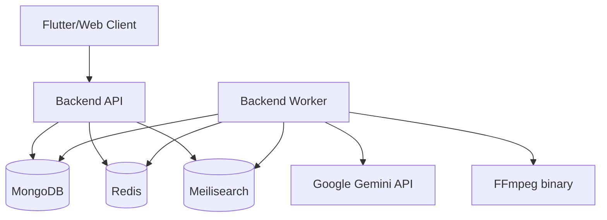

# Design Document: Backend Containerization and Meilisearch Migration

## Overview

This feature packages the backend API and worker with MongoDB, Redis, and Meilisearch in one Docker Compose application. The API and worker use one backend image with different commands. MongoDB, Redis, and Meilisearch run as separate Compose services with named volumes and healthchecks.

The search adapter will be migrated from OpenSearch to Meilisearch without changing the HTTP search contract. Gemini remains an external service used for AI analysis, and FFmpeg is installed in the backend image for local media processing.

## Architecture



Docker Compose defines the complete local/deployment stack:

- `api`: backend HTTP process
- `worker`: backend background process
- `mongo`: MongoDB with named data volume
- `redis`: Redis with named data volume
- `meilisearch`: Meilisearch with named index volume

The API and worker connect to `mongo`, `redis`, and `meilisearch` by Compose service name. No container uses `localhost` to reach another Service.

## Components and Interfaces

### Component 1: Docker Compose Application

**Purpose**: Orchestrate all backend runtime services with reproducible networking, configuration, healthchecks, and persistence.

**Interface**:

```yaml
services:
  api:
    build: ./backend
    command: ["bun", "src/index.ts"]
  worker:
    build: ./backend
    command: ["bun", "src/worker.ts"]
  mongo:
    image: mongo
  redis:
    image: redis
  meilisearch:
    image: getmeili/meilisearch
```

**Responsibilities**:

- Build and run the backend image for API and worker processes.
- Start dependencies with healthchecks.
- Supply environment variables to API and worker.
- Persist MongoDB, Redis, and Meilisearch data in named volumes.
- Define a private application network.
- Apply restart policies and dependency readiness conditions.

### Component 2: Backend Image

**Purpose**: Provide one runtime image containing the Bun application, production dependencies, compiled/runtime source, and FFmpeg.

**Interface**:

```text
API command:    bun src/index.ts
Worker command: bun src/worker.ts
Health command: HTTP GET /health
```

**Responsibilities**:

- Install FFmpeg through the image's OS package manager.
- Install backend dependencies from the lockfile.
- Run the API or worker command selected by Compose.
- Run as a non-root user when supported by the base image.

### Component 3: Meilisearch Adapter

**Purpose**: Implement the existing search indexing and querying boundary with Meilisearch.

**Interface**:

```ts
interface SearchIndex {
  index(document: SearchDocument): Promise<void>
  remove(documentId: string): Promise<void>
  search(query: string, options?: SearchOptions): Promise<SearchResult>
}
```

**Responsibilities**:

- Create or reference the configured Meilisearch index.
- Index documents with stable document identifiers.
- Remove documents by identifier.
- Translate Meilisearch responses into the existing application search response.
- Use `SEARCH_URL`, `SEARCH_INDEX`, and `SEARCH_API_KEY` configuration.

### Component 4: Environment Configuration

**Purpose**: Validate runtime configuration for local Compose and production deployment.

**Interface**:

```text
MONGO_URI=mongodb://mongo:27017
MONGO_DATABASE=saveyour-tech
REDIS_URL=redis://redis:6379
SEARCH_URL=http://meilisearch:7700
SEARCH_INDEX=saveyour-posts
SEARCH_API_KEY=<configured key>
GEMINI_API_KEY=<external API key>
```

**Responsibilities**:

- Provide service URLs using Compose names.
- Fail startup when required production settings are missing.
- Keep Gemini credentials external and secret.
- Avoid embedding secrets in the image or Compose file.

## Data Models

### Model 1: SearchDocument

```ts
interface SearchDocument {
  id: string
  ownerId: string
  sourceUrl: string
  sourcePlatform?: string
  title?: string
  text?: string
  tags?: string[]
  capturedAt: string
}
```

**Validation Rules**:

- `id` is stable and unique for the source record.
- `ownerId` is present for owner-scoped searches.
- `capturedAt` is an ISO timestamp.
- Searchable text is sent only after source persistence succeeds.

### Model 2: Compose Persistent Volumes

```text
mongo-data        MongoDB database files
redis-data        Redis persistence files, when enabled
meilisearch-data  Meilisearch index and configuration files
```

**Validation Rules**:

- Volumes are named rather than anonymous.
- `docker compose down` preserves volumes.
- Volume deletion requires an explicit destructive command.

## Error Handling

### Error Scenario 1: Dependency Not Ready

**Condition**: API or worker starts while MongoDB, Redis, or Meilisearch is unavailable.
**Response**: Compose delays dependent startup using healthcheck conditions; application readiness reports failure.
**Recovery**: Compose restart policy retries the affected Service without deleting volumes.

### Error Scenario 2: Meilisearch Request Failure

**Condition**: Indexing or search request to Meilisearch fails.
**Response**: API returns a controlled search/dependency error; MongoDB remains the source of truth.
**Recovery**: Worker retries indexing according to existing queue behavior, and an index rebuild can repopulate Meilisearch.

### Error Scenario 3: Invalid Configuration

**Condition**: Required environment variable is missing or malformed.
**Response**: API or worker exits with an error naming the configuration field.
**Recovery**: Operator corrects `.env` or deployment secrets and restarts Compose.

### Error Scenario 4: Gemini Unavailable

**Condition**: Google Gemini API is unavailable or rejects a request.
**Response**: Analysis enters the existing failure/partial handling path; captured source data remains persisted.
**Recovery**: Worker retry policy handles transient failures, and failed analysis can be retried.

## Testing Strategy

### Unit Testing Approach

- Test Meilisearch adapter request construction and response mapping with a mocked client.
- Test environment configuration for Compose service URLs and missing production values.
- Test API behavior when Meilisearch errors occur.
- Test that OpenSearch-specific imports and configuration are absent from runtime source.

### Property-Based Testing Approach

Property-based testing is not required for the Compose orchestration itself. Compose configuration, healthchecks, and external service wiring are better verified with schema checks, smoke tests, and integration tests. Search response mapping may use example-based tests because it is an external-service adapter with a stable response shape.

### Integration Testing Approach

- Run `docker compose config` to validate Compose interpolation and syntax.
- Build the backend image with `docker compose build`.
- Start the stack with `docker compose up -d`.
- Verify API health after MongoDB, Redis, and Meilisearch healthchecks pass.
- Insert a representative searchable record, index it through the worker/adapter, and query it through the API.
- Verify data remains after `docker compose down` followed by `docker compose up -d`.

## Performance Considerations

- Use one backend image layer for API and worker to avoid duplicate dependency installation.
- Keep Meilisearch indexing asynchronous through Redis-backed worker processing.
- Configure worker concurrency through `WORKER_CONCURRENCY`.
- Use healthcheck intervals and startup grace periods that avoid excessive retries during database initialization.
- Preserve existing Gemini timeout and retry settings.

## Security Considerations

- Do not commit Gemini or Meilisearch production keys.
- Pass secrets through `.env`, deployment secrets, or an equivalent secret manager.
- Do not expose MongoDB or Redis publicly by default.
- Restrict Meilisearch access to the application network unless explicit external access is required.
- Keep `AUTH_REQUIRED=true` in production.
- Run the backend container as a non-root user when possible.

## Dependencies

- Docker Engine
- Docker Compose v2
- Bun runtime
- MongoDB container image
- Redis container image
- Meilisearch container image
- FFmpeg package in the backend image
- Google Gemini API as an external service
- Existing MongoDB and Redis client libraries
- Meilisearch HTTP client or REST adapter
