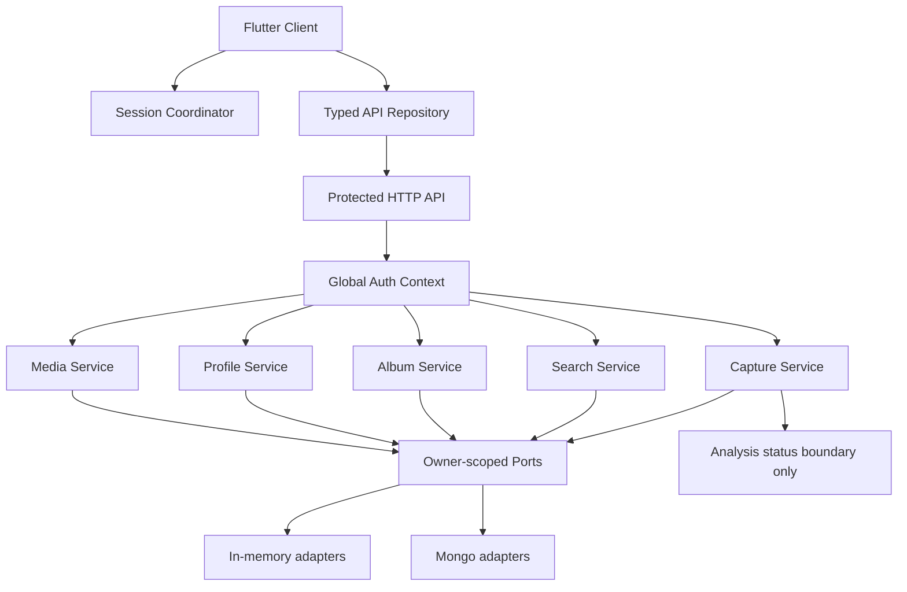

# Design Document: Complete Platform Rewrite

## 1. Purpose and non-negotiable outcome

Rewrite the existing saveyour.tech backend and Flutter client so a fresh agent can implement and verify the complete non-Cortex product without guessing at ownership, API shape, persistence behavior, or UI state. The rewrite is complete when a seeded authenticated fixture can sign in or restore a session, list/capture/search posts, load profile, create/rename/open albums, add/remove memberships, delete posts, sign out, and receive correct loading/error/empty states in Flutter.

Snowflake Cortex ingestion and analysis execution are explicitly excluded. Capture, persistence, media metadata, and analysis-status rendering are still required. The implementation must not silently replace failed or unavailable analysis with a false completed state.

## 2. Current code map

### Backend entry and infrastructure

- `backend/src/app.ts`: application composition, repository selection, auth service, route registration, dependency initialization.
- `backend/src/config/env.ts`: environment parsing.
- `backend/src/infrastructure/mongo/client.ts`: Mongo connection.
- `backend/src/infrastructure/mongo/auth-repositories.ts`: account/session persistence.
- `backend/src/infrastructure/mongo/persistent-repository.ts`: capture persistence.
- `backend/src/infrastructure/mongo/album-repository.ts`: album persistence.
- `backend/src/infrastructure/search/*`: search adapter and index initialization.

### Backend modules

- `backend/src/modules/auth/{auth,routes,service,owner-scope}.ts`: bearer/session auth and legacy owner header handling.
- `backend/src/modules/capture/{api-routes,service,repository,persistent-repository,types}.ts`: capture and post APIs.
- `backend/src/modules/albums/{routes,service,repository,types}.ts`: album CRUD and membership.
- `backend/src/modules/search/{routes,service,contracts,suggestions}.ts`: search and suggestions.
- `backend/src/modules/profile/routes.ts`: profile counts and identity.
- `backend/src/modules/media/*`: media access/storage.

### Flutter client

- `app/lib/main.dart`: app bootstrap, session restore, global shell, home capture/archive.
- `app/lib/services/auth.dart`: Google sign-in and session restore.
- `app/lib/services/session_store.dart`: secure session storage.
- `app/lib/services/api_client.dart`: HTTP repository implementation.
- `app/lib/domain/models.dart`: models, repository interfaces, mock repository.
- `app/lib/screens.dart`: albums, album detail, profile.
- `app/lib/widgets/*`: design-system controls, cards, detail dialog.
- `app/lib/theme/app_theme.dart`: tokens and Sora/neobrutalist theme.

## 3. Target architecture



### Architectural rule

The backend derives `ownerId` from the verified bearer token exactly once at the protected API boundary. Route modules receive typed auth context; they never require `x-owner-id` for normal authenticated requests and never trust a caller-selected owner ID. A legacy owner header may exist only in a dedicated unauthenticated test fixture mode and must be disabled when production auth is enabled.

## 4. Exact API contract

All protected endpoints accept `Authorization: Bearer <sessionToken>`. They return JSON. Errors use:

```typescript
interface ApiError {
  code: string;
  message: string;
  requestId?: string;
  field?: string;
}
```

### Authentication

`POST /auth/google`

Request:

```json
{"idToken":"google-id-token"}
```

Success `201`:

```json
{"account":{"id":"account-id","email":"demo@example.com","name":"Demo User","picture":null,"provider":"google"},"token":"opaque-session-token","expiresAt":1730000000000}
```

`GET /auth/me` with bearer token.

Success `200`:

```json
{"accountId":"account-id","name":"Demo User","email":"demo@example.com","picture":null}
```

`POST /auth/sign-out` with bearer token.

Success `200`: `{"status":"ok"}`. Revocation is idempotent.

### Capture and posts

`POST /capture`

Request: `{"url":"https://example.com/post"}`. Optional `idempotency-key` header.

Success `201` or duplicate `200`:

```json
{"postId":"post-id","duplicate":false,"replayed":false,"sourceStatus":"captured","analysisStatus":"pending"}
```

`GET /captured-posts?cursor=<opaque>&limit=<1..100>`

Success:

```json
{"items":[{"id":"post-id","ownerId":"internal-only","canonicalUrl":"https://example.com/post","title":"Title","description":"Description","platform":"x","mediaKind":"text","thumbnailUrl":null,"sourceStatus":"captured","analysisStatus":"pending","capturedAt":"2026-01-01T00:00:00.000Z","deletionState":"active","albums":[],"tags":[]}],"nextCursor":null}
```

The public response must omit `ownerId`, token data, internal storage keys, and credentials. The Flutter parser may accept a bare list for backward compatibility but the backend emits the envelope. `GET /captured-posts/:postId` uses the same public post shape.

`GET /captured-posts/:postId` returns one post object.

`DELETE /captured-posts/:postId` returns `204` or `{"status":"deleted"}`. Missing/foreign posts return the same `404` shape.

### Search

`GET /v1/search?q=<text>&tags=<csv>&platform=<value>&albumId=<id>&mediaType=<value>&cursor=<opaque>&limit=<1..100>`

Success uses the same `{items,nextCursor}` envelope. Every filter is owner-scoped.

`GET /v1/search/suggestions?q=<text>&limit=<1..50>`

Success: `{"items":["tag-one","tag-two"]}`. Suggestions are owner-scoped.

### Albums

`GET /albums?q=<text>&tags=<csv>` returns an array of summaries:

```json
[{"id":"album-id","name":"Reading","postCount":2,"tags":["books"],"visibility":"private","createdAt":"2026-01-01T00:00:00.000Z","updatedAt":"2026-01-01T00:00:00.000Z","coverPost":null}]
```

`POST /albums` request `{"name":"Reading"}`; success `201` returns an album summary. Names are trimmed, 1–120 characters, and unique case-insensitively per owner.

`PATCH /albums/:albumId` request `{"name":"Renamed"}`; success `200` returns updated summary.

`GET /albums/:albumId` success:

```json
{"album":{"id":"album-id","name":"Reading","postCount":2,"tags":[],"visibility":"private","createdAt":"...","updatedAt":"...","coverPost":null},"posts":[/* post objects */]}
```

`POST /albums/:albumId/posts/:postId` and `DELETE /albums/:albumId/posts/:postId` return the updated album summary. Both are idempotent. Foreign resources are indistinguishable from not found.

### Profile

`GET /profile` success:

```json
{"displayName":"Demo User","username":"demo@example.com","avatarUrl":null,"savedPostCount":5,"albumCount":3,"sourceCount":3,"tagCount":6}
```

Counts must be computed from owner-scoped active data, not hard-coded.

## 5. Backend implementation contract

### Auth context implementation

Create a shared module under `backend/src/modules/auth/` exporting:

```typescript
interface AuthenticatedContext {
  ownerId: string;
  sessionId: string;
  accountId: string;
}

const authPlugin: Elysia;
const requireAuthenticated: <T>(handler: (ctx: AuthenticatedContext & T) => unknown) => unknown;
```

Use an Elysia plugin composition that preserves TypeScript context typing in consuming route modules. If Elysia cannot infer plugin-derived fields across factory functions, define a typed route context helper or use `resolve` on the route instance itself; do not cast arbitrary `any` throughout the codebase. Add a compile-time test or typecheck proof that route handlers see `authenticated.ownerId`.

Authentication sequence:

1. Read `Authorization` header.
2. Require exactly one bearer token for protected routes.
3. Hash token and load session.
4. Reject missing, unknown, expired, or revoked session.
5. Load account by session account ID.
6. Attach `{ownerId: account.id, sessionId: session.id, accountId: account.id}`.
7. Route handler passes `ownerId` into service/repository methods.

### Repository rules

Every repository method that reads, writes, or deletes user data accepts owner ID as an argument or embeds owner ID in an already-authorized value. Mongo queries must include owner predicates. Add indexes:

- accounts: provider subject unique; account ID unique.
- sessions: token hash unique; account ID; expiry.
- posts: owner ID + canonical URL unique for active records; owner ID + updatedAt; owner ID + deletion state.
- albums: owner ID + case-normalized name unique; owner ID + updatedAt.

Batch album post loading in Mongo using `$in` rather than one query per post.

### Seed contract

Add `backend/src/infrastructure/seed/seed-data.ts` and `backend/src/infrastructure/seed/seed.ts`.

Seed values:

- Account ID: `seed-account-001`.
- Email: `demo@saveyour.tech`.
- Session fixture token: `seed-session-token-001` in development/test only.
- Five posts with IDs `seed-post-001` through `seed-post-005`.
- Three albums with IDs `seed-album-reading`, `seed-album-ideas`, `seed-album-recipes`.
- At least one membership per album.

Seed must be idempotent by stable IDs, preserve existing user data, and throw if invoked with production configuration. Expose a terminable command such as `bun run seed` and call the same builder from integration tests. Do not seed Cortex-derived results; use `analysisStatus: "pending"` and stable source metadata.

## 6. Flutter implementation contract

### Session lifecycle

`GoogleAuthService.restoreSession()` loads secure session, calls `GET /auth/me`, and clears the session if the response is unauthorized or malformed. `signOut()` attempts server revocation, always clears local secure storage in `finally`, and resets in-memory state.

`ApiClient`:

- Takes one `SessionStore`.
- Adds `Authorization` only when a session exists.
- Uses a 20-second timeout for GET/POST/PATCH/DELETE.
- Maps JSON `{code,message,field}` to `ApiException`.
- Clears session only on confirmed `401`, through an injected `onUnauthorized` callback.
- Emits typed model parsing errors for malformed success responses.

### Screen responsibilities

- `HomePage`: session gate, search, archive list, capture, post detail, refresh, empty/error/retry.
- `AlbumsPage`: list/search/create, empty/error/retry, open detail.
- `AlbumDetailPage`: fetch/detail retry, rename, scoped search, post detail, add/remove membership, refresh after mutation.
- `ProfilePage`: profile fetch/retry, counts, sign-out.
- `PostDetailModal`: source link, media fallback, analysis status, albums, add/remove, delete; all mutations await server response before dismiss/refresh.

All screens must use existing neobrutalist primitives and Sora. No `NavigationBar`, `FloatingActionButton`, `AlertDialog`, or default `FilterChip` may be introduced for product surfaces without a custom themed wrapper.

## 7. State matrix

Every async surface must explicitly implement:

| Operation | Initial | Loading | Success | Empty | Failure | Retry/mutation |
|---|---|---|---|---|---|---|
| Archive | yes | skeleton/progress | cards | next-action empty | retry panel | pull refresh |
| Search | query idle | debounced progress | results | rewrite/clear | retry preserving query | retry |
| Capture | closed | submitting | receipt/snackbar + refresh | n/a | preserve URL | retry |
| Album list | yes | progress | album tiles | create action | retry | refresh |
| Album detail | yes | progress | detail/posts | empty album | retry/not found | rename/add/remove |
| Profile | yes | progress | identity/counts | n/a | retry | sign out |

## 8. Testing and commands

Baseline and final commands:

```bash
cd backend && bun run format --check && bun run typecheck && bun test
cd app && dart format --set-exit-if-changed lib test && flutter analyze && flutter test && flutter build apk --debug
```

Required backend tests:

- Auth context accepts valid fixture bearer token.
- Missing/invalid/expired/revoked bearer token fails every protected module.
- One fixture token accesses capture, posts, search, suggestions, albums, membership, profile, and media.
- Foreign owner cannot read/mutate any resource.
- Seed repeatability and production refusal.
- Album create/rename/add/remove idempotence.
- Capture duplicate behavior.

Required Flutter tests:

- Restore valid session and load profile/archive.
- Unauthorized API response clears session.
- Capture validation, success, timeout, and failure preservation.
- Album list/create/rename/detail/membership/error states.
- Search query preservation and retry.
- Profile counts and sign-out.
- Post detail mutation refresh.

## 9. Commit checkpoints

Use the git-commit skill. Every checkpoint must pass its listed verification before committing:

1. `feat: establish authenticated owner context` — auth unit/type tests.
2. `feat: add deterministic development seed` — seed and persistence tests.
3. `fix: complete owner scoped backend APIs` — backend full suite.
4. `feat: wire flutter session and api contract` — Flutter service tests.
5. `feat: complete archive and album flows` — Flutter widget suite.
6. `test: add end to end platform coverage` — complete integration matrix.
7. `chore: finalize rewrite verification` — all commands and clean tree.

Never commit `.env` secrets, generated build output, or debug logs.
