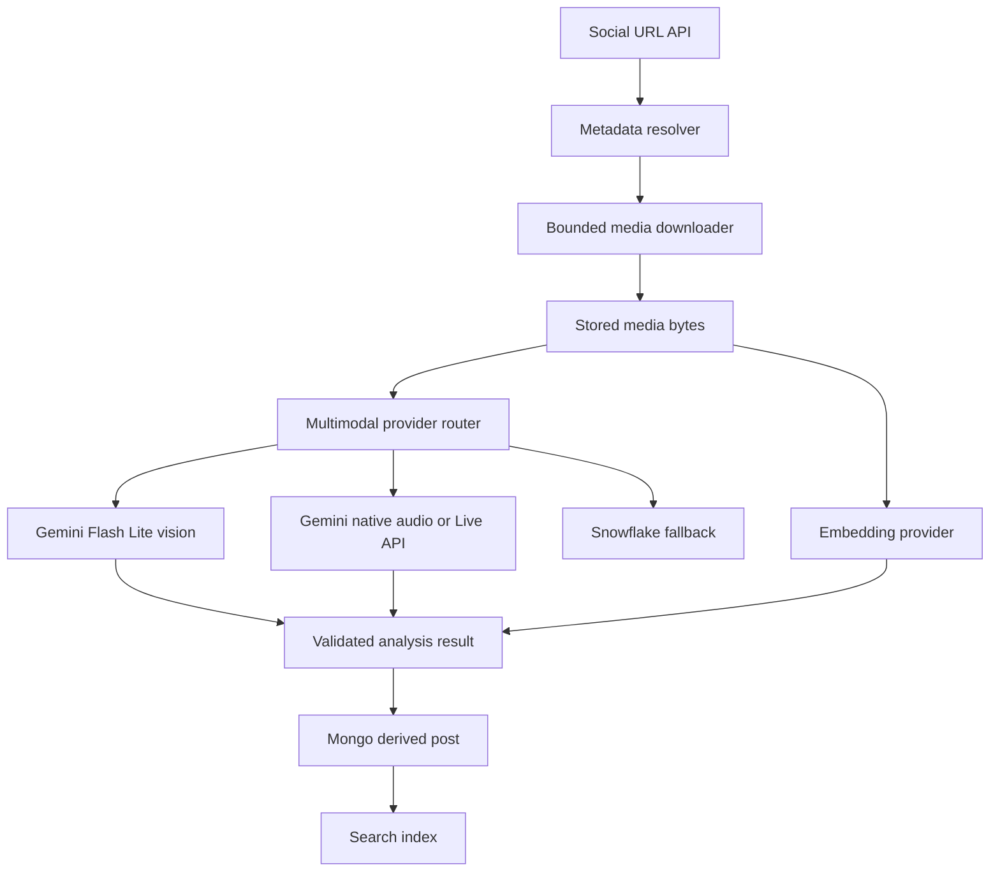

# Design Document: Fast Multimodal Analysis

## Overview

Replace the current Snowflake Cortex LLM path for visual recognition with a verified Gemini multimodal provider, while preserving Snowflake for embeddings unless benchmarks show a faster compatible alternative. Add a real audio-input path and benchmark Gemini native audio against the existing Snowflake transcription path before selecting the production default.

The pipeline must accept a social-media URL, resolve and download the actual media, pass image or audio bytes to the selected provider, normalize structured output, persist results without MongoDB `_id` mutation, and reach a terminal job status. Visual recognition has a target p95 latency below 10 seconds from analysis dispatch after media download.

## Architecture



## Components and Interfaces

### Media Resolution

**Purpose**: Resolve social pages to first-party media URLs and download bounded, validated bytes.

```typescript
interface MediaResolver {
  resolve(url: string, signal?: AbortSignal): Promise<ResolvedSource>
}

interface MediaInput {
  bytes: Uint8Array
  mimeType: string
  durationMs?: number
}
```

The resolver SHALL preserve the actual media bytes in the accepted post or an authorized media store reference. URL text alone is not a valid visual input.

### Gemini Multimodal Provider

**Purpose**: Describe images and transcribe audio using direct multimodal Gemini requests.

```typescript
interface MultimodalProvider extends AiProvider {
  describeImage(input: AiInput): Promise<GeneratedDescription>
  transcribe(input: AiInput): Promise<Transcript>
}
```

Image requests SHALL use an inline binary part or an equivalent provider-supported media reference. Audio requests SHALL use an audio part or the Live API only when streaming latency is better than native file generation.

### Provider Router

**Purpose**: Select providers by operation and capability, not merely by credential presence.

```typescript
interface ProviderRouter {
  vision(): AiProvider
  transcription(): AiProvider
  embeddings(): AiProvider
}
```

Default selection:

- Vision: verified Gemini Flash Lite model ID.
- Transcription: benchmark winner between Gemini native audio and Gemini Live API; Snowflake fallback.
- Embeddings: Snowflake `EMBED_TEXT_768` unless benchmarked alternative meets schema and latency requirements.

### Result Validation

Provider output SHALL be normalized into the existing `GeneratedDescription`, `Transcript`, and embedding contracts. JSON extraction may tolerate fenced or surrounding prose, but invalid or semantically empty output remains an error.

## Data Models

```typescript
interface GeneratedDescription {
  text: string
  tags: string[]
  provenance: Provenance
}

interface ProviderBenchmark {
  operation: "vision" | "transcription"
  model: string
  mediaBytes: number
  connectionMs: number
  providerMs: number
  totalMs: number
  success: boolean
  error?: string
}
```

Validation rules:

- Image MIME types must be supported and payloads must respect configured size limits.
- Media bytes must be non-empty.
- Vision output must contain a non-empty description.
- Transcript segments must have valid non-negative ranges.
- Embedding vectors must contain finite numeric values and a configured dimension.
- Provider provenance must identify provider and model.

## Error Handling

### Media Resolution Failure

If a social page cannot produce a valid media URL or download, the system SHALL record a retryable stage error with the source and downloader failure reason. The system SHALL not send the social URL to a vision model as a substitute for image bytes.

### Unsupported Model ID

At startup or first use, the provider SHALL validate configured model availability. An unsupported model SHALL produce a configuration or capability error and SHALL not be retried as a transient request.

### Provider Timeout

The provider SHALL use operation-specific deadlines. Vision requests target 10 seconds p95 and have a bounded hard timeout. A timeout SHALL release the request resources and produce a retryable error without leaving a stage permanently processing.

### Invalid Provider Output

The normalizer SHALL reject empty or unusable output and record a response error. The normalizer SHALL accept valid JSON embedded in fenced or surrounding text.

## Testing Strategy

### Unit Testing Approach

- Verify Gemini image requests contain an image part with the exact media bytes and MIME type.
- Verify audio requests contain audio input rather than URL text.
- Verify provider routing selects Gemini vision when configured and falls back only on capability failure.
- Verify model discovery and configuration errors are non-retryable.
- Verify timeout cleanup and bounded retries.
- Verify media resolver extracts Instagram CDN URLs and downloads JPEG bytes.

### Property-Based Testing Approach

Property-based tests are appropriate for pure response normalization and byte-slice conversion:

- For every valid byte subarray, base64 encoding and provider decoding preserve the exact byte sequence.
- For every valid structured provider response, normalization preserves description text and valid tags.
- For every invalid response, normalization returns a deterministic response error.

Property Test Library: Bun test with deterministic generated fixtures; add a property-testing dependency only if existing repository conventions support it.

### Integration Testing Approach

- Run a real Instagram fixture through URL resolution, media download, provider request, Mongo persistence, and search indexing.
- Run a controlled Gemini vision request and record latency and output correctness.
- Run equivalent transcription fixtures through Gemini native audio, Gemini Live API where supported, and Snowflake.
- Assert terminal job status, no `_id` error, non-empty media bytes, bunny/Scrabble semantic content, and p95 vision latency target in benchmark runs.

## Performance Considerations

- Prefer direct Gemini HTTP over Snowflake SQL for vision.
- Reuse HTTP connections through fetch keep-alive behavior where available.
- Avoid base64 conversion when provider supports binary upload or URI references; otherwise encode only once using the exact byte slice.
- Download media once and persist it for retries.
- Run independent post-vision stages only when their ordering permits; avoid repeated Cortex connections.
- Record connection, download, provider, normalization, and persistence timings separately.
- Treat 10 seconds as a p95 target for vision after media availability, with explicit failure at the hard deadline.

## Security Considerations

- Restrict downloader hosts and block private addresses.
- Do not log media bytes, API keys, signed URLs, or provider payloads.
- Scope media reads by owner ID.
- Keep provider credentials in environment configuration.
- Validate remote content type, size, checksum, and redirects.

## Dependencies

- Gemini Generate Content API for multimodal vision and native audio.
- Gemini Live API only if benchmarked transcription latency is superior.
- Snowflake SDK for embeddings and fallback operations.
- MongoDB for jobs, media metadata, and derived results.
- SeaweedFS for durable media storage.
- Redis for job queues.
- Meilisearch for indexing.
