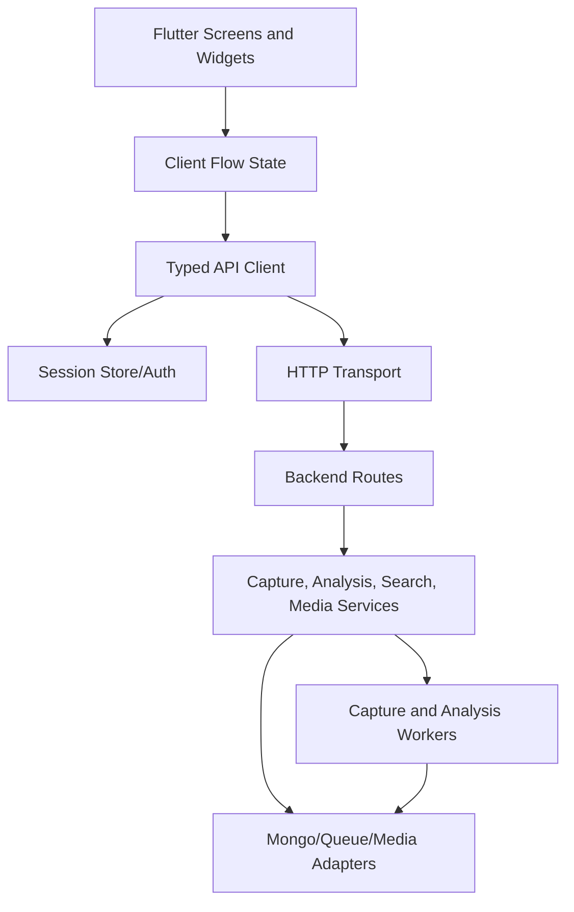

# Design Document: Frontend-Backend Integration

## Overview

The application already contains a substantial Flutter Client, a TypeScript API, capture and analysis modules, persistence adapters, and tests. The remaining work is to make the boundary explicit and dependable: identify the actual API surface, align Flutter models and request handling with backend contracts, centralize session/error behavior, and verify the user journey from authentication through capture, processing, and post display.

The design preserves the existing backend domain modules and infrastructure while introducing a thin, typed integration layer in the Client and contract-focused tests in both projects. Refactoring is limited to seams that currently make behavior ambiguous: API base URL and authentication handling, response decoding, status normalization, capture lifecycle state, and UI state transitions.

## Architecture



The Client owns presentation state, typed decoding, retries, and polling cancellation. The API owns authorization, validation, orchestration, persistence, and terminal status semantics. The Integration Contract is represented by explicit Dart models and backend route tests; where practical, shared fixtures prevent drift.

## Components and Interfaces

### Component 1: Typed API Client

**Purpose**: Provide one authenticated transport boundary for all MVP API calls.

**Interface**:

```dart
abstract interface class ApiClient {
  Future<SessionDto> signIn(SignInRequest request);
  Future<List<PostDto>> listPosts({int? limit, String? cursor});
  Future<PostDto> getPost(String postId);
  Future<CaptureDto> createCapture(CreateCaptureRequest request);
  Future<CaptureDto> getCapture(String captureId);
  Future<MediaReferenceDto> getMedia(String mediaId);
}
```

**Responsibilities**:

- Build URLs from one configurable API base URL.
- Attach and refresh/use the current session credential.
- Decode successful responses into typed DTOs.
- Normalize backend error envelopes into a typed client exception.
- Reject malformed required responses with diagnostic-safe errors.

### Component 2: Session Manager

**Purpose**: Restore, persist, invalidate, and expose the Authenticated Session.

**Interface**:

```dart
abstract interface class SessionManager {
  Future<Session?> restore();
  Future<void> save(Session session);
  Future<void> clear();
  Session? get current;
}
```

**Responsibilities**:

- Reuse `session_store.dart` and `auth.dart` abstractions.
- Provide credentials to `ApiClient` without coupling screens to storage.
- Clear sessions on confirmed authentication failures.
- Notify the app shell when the session changes.

### Component 3: Capture Flow Controller

**Purpose**: Coordinate validation, submission, polling, terminal status, and navigation.

**Interface**:

```dart
enum CapturePhase { idle, submitting, queued, processing, completed, failed }

abstract interface class CaptureController {
  CapturePhase get phase;
  Future<void> submit(String sourceUrl);
  Future<void> cancel();
}
```

**Responsibilities**:

- Validate source URLs before network calls.
- Prevent duplicate submissions and overlapping status requests.
- Poll only for non-terminal statuses at a bounded interval.
- Stop polling on completion, failure, cancellation, or disposal.
- Expose stable user-facing errors and the completed Post reference.

### Component 4: Feed and Detail Controllers

**Purpose**: Convert API responses into screen state with consistent loading, empty, retry, and error behavior.

**Responsibilities**:

- Load and refresh posts.
- Preserve already-rendered data when a refresh fails.
- Load post detail and media independently where possible.
- Expose source actions using canonical URLs.

### Component 5: Backend Contract Adapters

**Purpose**: Make route responses and status semantics consistent for the Client.

**Responsibilities**:

- Audit `backend/src/modules/*/routes.ts` against the Client's calls.
- Standardize status names, identifiers, pagination, and error envelopes.
- Ensure owner scope is applied to capture, post, and media lookups.
- Keep infrastructure-specific errors out of public responses.

## Data Models

### Session

```dart
class Session {
  final String accessToken;
  final String userId;
  final DateTime? expiresAt;
}
```

**Validation Rules**:

- `accessToken` and `userId` are non-empty.
- Expired sessions cannot be restored as active sessions.

### PostDto

```dart
class PostDto {
  final String id;
  final String? title;
  final String? description;
  final String? sourceUrl;
  final List<MediaReferenceDto> media;
  final DateTime? createdAt;
  final Map<String, dynamic> metadata;
}
```

**Validation Rules**:

- `id` is non-empty.
- Optional fields tolerate absent or unknown values.
- Media references are decoded independently so missing media does not invalidate metadata.

### CaptureDto

```dart
class CaptureDto {
  final String id;
  final CaptureStatus status;
  final String? postId;
  final String? message;
}

enum CaptureStatus { queued, processing, completed, failed }
```

**Validation Rules**:

- `id` is non-empty.
- Unknown future statuses map to a safe non-terminal state or a typed incompatibility error according to the contract policy.
- `postId` is required for completed captures before detail navigation.

### ErrorEnvelope

```dart
class ApiError {
  final String code;
  final String message;
  final Map<String, dynamic>? details;
  final bool retryable;
}
```

The backend uses a stable JSON error shape with a public `code` and safe `message`; stack traces and provider credentials remain server-side.

## Error Handling

### Authentication Failure

**Condition**: A protected request returns an authentication or authorization response.
**Response**: `ApiClient` raises a typed authentication exception.
**Recovery**: `SessionManager` clears the session and the app shell routes to sign-in; the original request is not retried indefinitely.

### Validation or Policy Rejection

**Condition**: Capture URL or request data fails backend validation.
**Response**: API returns a stable client error code and field-level details where safe.
**Recovery**: Client displays the validation message and keeps the form data available for correction.

### Transient Network or Dependency Failure

**Condition**: Timeout, unavailable queue, or temporary backend failure.
**Response**: API returns a safe retryable error where possible; Client preserves unaffected state.
**Recovery**: Client offers explicit retry with bounded retry behavior and no duplicate capture creation.

### Malformed Response or Contract Drift

**Condition**: Required response fields are missing or have incompatible types.
**Response**: Client records endpoint and parsing context without secrets and raises a generic integration error.
**Recovery**: UI displays a recoverable error; contract tests identify the mismatch before release.

### Capture Terminal Failure

**Condition**: Worker processing ends in a failed state.
**Response**: API returns terminal status and diagnostic-safe message.
**Recovery**: Client stops polling and offers retry/dismiss actions; retry creates a new idempotently tracked attempt according to backend policy.

## Testing Strategy

### Unit Testing Approach

- Dart unit tests for URL validation, response decoding, error mapping, session restoration, status classification, and polling state transitions.
- Flutter widget tests for loading, empty, error, retry, capture submission, completed navigation, and media fallback states.
- TypeScript unit tests for route validation, authorization/owner scope, status mapping, and error serialization.

### Property-Based Testing Approach

Use `fast-check` for pure TypeScript transformations and `package:checks` or focused generated cases in Dart where practical. Property tests should cover URL normalization, error-envelope decoding, capture status terminality, and serialization round trips. UI layout and external integrations remain example-based or integration-tested.

### Integration Testing Approach

- Backend route tests exercise authenticated and unauthenticated requests against test doubles for Mongo, Redis, media, and AI providers.
- Client/API contract fixtures verify method, path, headers, body, response fields, status values, and error envelopes.
- End-to-end tests cover sign-in/session restore, feed load, capture submission, queued-to-completed polling, post detail, media failure fallback, and terminal capture failure.
- Run backend tests and Flutter tests in CI with documented environment setup and deterministic fake dependencies.

## Correctness Properties

_A property is a characteristic or behavior that should hold true across all valid executions of a system-essentially, a formal statement about what the system should do. Properties serve as the bridge between human-readable specifications and machine-verifiable correctness guarantees._

### Property 1: Session round trip preserves usable credentials

For all valid sessions, serializing and restoring a non-expired session preserves the access token and user identifier, while an expired session is not treated as active.

**Validates: Requirements 1.2, 1.4**

### Property 2: Protected requests carry the current session

For all protected API requests made while an Authenticated Session exists, the request contains the current session credential exactly once.

**Validates: Requirements 1.3, 7.1**

### Property 3: Valid captures produce one tracked lifecycle

For all valid source URLs, submitting a Capture produces one capture identifier, and every subsequent status request uses that identifier until a terminal status is reached.

**Validates: Requirements 3.1, 3.3, 4.1**

### Property 4: Terminal statuses stop polling

For all capture status sequences, once a completed or failed status is observed, the Client performs no further polling for that capture.

**Validates: Requirements 4.3, 4.5**

### Property 5: Error envelopes map without leaking diagnostics

For all backend error envelopes, the Client exposes the public code/message and retryability while excluding stack traces, credentials, and infrastructure secrets from user-facing output.

**Validates: Requirements 6.3, 6.4**

### Property 6: Post decoding tolerates unknown optional fields

For all valid Post responses with additional optional fields, typed Client decoding preserves all required fields and succeeds without treating unknown optional fields as fatal.

**Validates: Requirements 2.2, 7.4**

## Performance Considerations

- Bound capture polling intervals and prevent overlapping requests.
- Paginate feed responses and avoid downloading media until needed.
- Reuse HTTP clients and cancel requests when screens/controllers are disposed.
- Keep contract fixtures small and use fakes for unit tests; reserve real infrastructure for integration tests.

## Security Considerations

- Store access credentials only through the existing secure session abstraction.
- Enforce owner scope in backend capture, post, and media routes.
- Validate and restrict source URLs using the existing URL policy to reduce SSRF risk.
- Avoid logging tokens, provider credentials, raw private media URLs, or stack traces.
- Apply rate limits to authentication, capture, and status endpoints.

## Dependencies

- Flutter/Dart client dependencies already declared in `app/pubspec.yaml`.
- TypeScript/Bun backend dependencies declared in `backend/package.json`.
- Existing MongoDB, Redis, Meilisearch, SeaweedFS, and AI provider adapters, with deterministic test doubles for local and CI tests.
