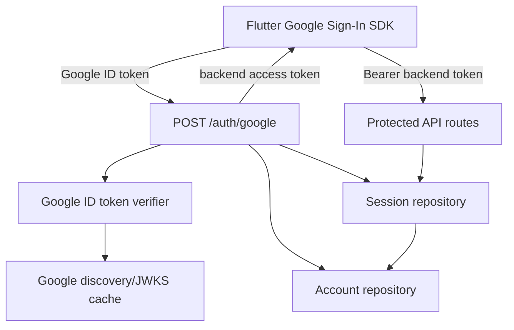

# Design Document: Google OAuth Backend

## Overview

The backend already exposes `/auth/google`, but the endpoint currently trusts client-supplied claims and stores accounts and sessions in memory. This design replaces that trust boundary with server-side Google OpenID Connect ID-token verification, preserves the existing bearer-session model for protected routes, and defines a Flutter-friendly API contract.

The implementation uses a verifier abstraction so unit tests can use deterministic fixtures while production uses Google's discovery document and JWKS endpoints. Account and session persistence are abstracted behind repositories: in-memory repositories remain available for development/tests, while MongoDB repositories provide durable production state. Session credentials are returned once and stored only as SHA-256 hashes.

## Architecture



The request token is never treated as an account identifier. The verifier checks the JWT signature and claims using server-side configuration. The resulting Google `sub` is the stable account key. The Flutter client stores the backend token securely and sends it as `Authorization: Bearer <token>`.

## Components and Interfaces

### Component 1: GoogleTokenVerifier

**Purpose**: Verify Google-issued OpenID Connect ID tokens without trusting request claims.

**Interface**:

```typescript
interface GoogleTokenVerifier {
  verify(idToken: string, expected: {
    clientId: string;
    issuer: string;
    nonce?: string;
  }): Promise<VerifiedGoogleIdentity>;
}

interface VerifiedGoogleIdentity {
  subject: string;
  email: string;
  issuer: string;
  audience: string;
  expiresAt: number;
  nonce?: string;
}
```

**Responsibilities**:

- Parse JWT headers and claims.
- Fetch and cache Google JWKS keys using discovery/cache metadata.
- Verify signature, issuer, audience, expiry, subject, email, and optional nonce.
- Map provider failures to `AUTH_INVALID`, `AUTH_EXPIRED`, or `AUTH_PROVIDER_UNAVAILABLE`.
- Never log token values or signing keys.

### Component 2: AuthService

**Purpose**: Convert verified Google identities into accounts and backend sessions.

**Interface**:

```typescript
interface AuthService {
  signIn(idToken: string, options: SignInOptions): Promise<SignInResult>;
  authenticate(token: string): Promise<OwnerScope>;
  revoke(token: string): Promise<void>;
}

interface SignInOptions {
  clientId: string;
  issuer: string;
  sessionTtlSeconds: number;
  nonce?: string;
}
```

**Responsibilities**:

- Call `GoogleTokenVerifier`.
- Find or create an Account by `(provider = "google", subject)`.
- Create a cryptographically random session token.
- Persist only the token hash and expiry.
- Resolve valid non-revoked sessions to owner scopes.
- Make sign-out idempotent.

### Component 3: AccountRepository

```typescript
interface AccountRepository {
  findByGoogleSubject(subject: string): Promise<Account | undefined>;
  create(account: Account): Promise<Account>;
  updateEmail(id: string, email: string): Promise<Account>;
  ensureIndexes(): Promise<void>;
}
```

MongoDB must enforce a unique index on the Google subject/provider pair. In-memory implementation supports tests and local development.

### Component 4: SessionRepository

```typescript
interface SessionRepository {
  create(session: SessionRecord): Promise<void>;
  findByTokenHash(tokenHash: string): Promise<SessionRecord | undefined>;
  revokeByTokenHash(tokenHash: string, revokedAt: number): Promise<void>;
  ensureIndexes(): Promise<void>;
}
```

The token hash is the lookup key. MongoDB must index it uniquely and may expire records using a TTL index on `expiresAt`.

### Component 5: AuthRoutes

Endpoints:

- `POST /auth/google`: accepts `{ "idToken": string }`; returns `201` with `{ account, token, expiresAt }`.
- `GET /auth/me`: returns the authenticated account for a valid bearer token.
- `POST /auth/sign-out`: accepts the bearer token and returns `{ "status": "ok" }` whether or not the session already exists.

Route validation rejects missing or empty `idToken` with HTTP 400. Authentication failures return HTTP 401. Provider availability failures return HTTP 503. OpenAPI schemas document all response shapes.

### Component 6: Authentication Middleware

The current static-token middleware should be replaced or extended to resolve bearer tokens through `AuthService`. It should preserve configured static tokens only as an explicit development compatibility mode, never as the production Google OAuth mechanism. Protected routes should receive `authenticatedOwnerId` or use their existing `AuthService` scope helper consistently.

## Data Models

### Account

```typescript
interface Account {
  id: string;
  provider: "google";
  googleSubject: string;
  email: string;
  createdAt: string;
  updatedAt: string;
}
```

**Validation Rules**:

- `googleSubject` is non-empty and unique per provider.
- `email` is normalized to lowercase and trimmed.
- Provider is a server-controlled literal.
- Account IDs are server-generated UUIDs.

### SessionRecord

```typescript
interface SessionRecord {
  id: string;
  accountId: string;
  tokenHash: string;
  expiresAt: number;
  createdAt: number;
  revokedAt?: number;
}
```

**Validation Rules**:

- `tokenHash` is a SHA-256 digest and never the raw token.
- `expiresAt` must be later than `createdAt`.
- Revoked or expired records cannot authenticate.

### Flutter Auth Contract

```json
POST /auth/google
Content-Type: application/json

{"idToken":"<Google ID token>"}
```

```json
{
  "account": {
    "id": "uuid",
    "provider": "google",
    "email": "user@example.com",
    "createdAt": "2026-01-01T00:00:00.000Z",
    "updatedAt": "2026-01-01T00:00:00.000Z"
  },
  "token": "<backend bearer token>",
  "expiresAt": "2026-01-31T00:00:00.000Z"
}
```

Flutter sends `Authorization: Bearer <backend bearer token>` to protected endpoints. Error bodies use `{ "code": string, "message": string, "requestId"?: string }`.

## Error Handling

### Invalid or Expired Google Token

**Condition**: Signature, issuer, audience, nonce, required claim, or expiration validation fails.
**Response**: HTTP 401 with `AUTH_INVALID` or `AUTH_EXPIRED`.
**Recovery**: Flutter clears the failed Google credential and starts a fresh Google sign-in flow.

### Google Provider Unavailable

**Condition**: Discovery/JWKS retrieval fails and no valid cached key is available.
**Response**: HTTP 503 with `AUTH_PROVIDER_UNAVAILABLE`.
**Recovery**: Flutter can retry with bounded backoff; backend retains no session side effect.

### Missing or Invalid Backend Session

**Condition**: Protected request has no bearer token, malformed token, unknown hash, expired session, or revoked session.
**Response**: HTTP 401 with `AUTH_REQUIRED`, `AUTH_INVALID`, or `AUTH_EXPIRED`.
**Recovery**: Flutter performs Google sign-in again.

### Missing Production Configuration

**Condition**: Google client ID or issuer configuration is absent in production.
**Response**: Application startup fails with a descriptive configuration error.
**Recovery**: Operator supplies environment configuration and restarts the service.

## Testing Strategy

### Unit Testing Approach

- Verify issuer, audience, expiry, subject, email, and nonce validation with valid and invalid JWT fixtures.
- Verify invalid tokens never create accounts or sessions.
- Verify repeated sign-in for one Google subject reuses the account.
- Verify session hashing, expiry, revocation, and idempotent sign-out.
- Verify route schemas and stable status/error codes.
- Verify production configuration validation and development defaults.

### Property-Based Testing Approach

The feature's external token verification and persistence are integration-heavy, so most tests are example-based with mocked verifier/repositories. Property-based tests are appropriate for pure session-token handling and contract serialization:

- For every generated non-empty session token, hashing produces a fixed-length digest and authentication lookup uses the digest rather than the raw token.
- For every generated valid account identity, signing in repeatedly preserves the same account ID.
- For every generated response model, JSON serialization and deserialization preserve the documented fields (round-trip property).

Property Test Library: Bun test with deterministic generators; add `fast-check` only if the repository adopts a property-testing dependency.

### Integration Testing Approach

- Start the Elysia app with an injected fake verifier and in-memory repositories.
- Exercise `/auth/google`, `/auth/me`, protected capture routes, and `/auth/sign-out` end to end.
- Verify OpenAPI output includes the auth contract.
- Use one mocked JWKS/discovery fixture to verify key caching and provider outage behavior.
- Run Mongo-backed repository tests separately when MongoDB is available.

## Performance Considerations

- Cache Google discovery/JWKS keys according to provider cache headers to avoid a network request per login.
- Hash session tokens once per request and index hashes.
- Use MongoDB unique indexes for account lookup and session indexes for bearer authentication.
- Keep token verification asynchronous and bounded by the existing request timeout.

## Security Considerations

- Never accept `issuer`, `audience`, `nonce`, or identity claims from the Flutter request body.
- Validate Google signatures against trusted Google keys and configured audience.
- Use cryptographically random backend tokens and store only hashes.
- Avoid logging raw Google tokens, backend tokens, email-based secrets, or JWKS contents.
- Require HTTPS in deployed environments and configure exact Flutter/web origins through CORS.
- Rotate/revoke sessions on sign-out; use bounded session TTLs.
- Enforce unique provider subject mapping to prevent account duplication or identity takeover.

## Dependencies

- Google OpenID Connect discovery and JWKS endpoints.
- A JWT/JWK verification library compatible with Bun, preferably Web Crypto based.
- Existing Elysia and OpenAPI packages.
- Existing MongoDB infrastructure for durable Account and Session repositories.
- Flutter Google Sign-In SDK on the client side.
