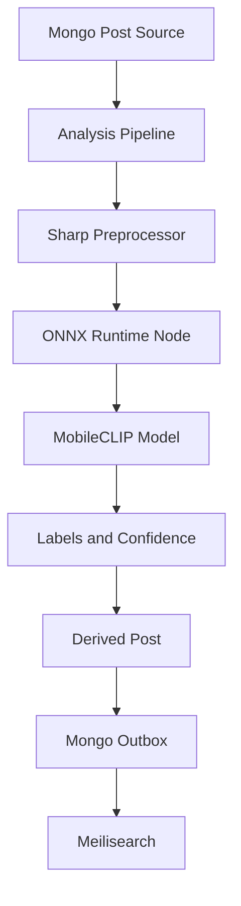

# Design Document: MobileCLIP Image Tagging

## Overview

The worker will run a local ONNX image tagger in the Bun process. Images are decoded with Sharp, resized and normalized for a MobileCLIP-compatible model, then evaluated against a configured semantic label vocabulary. The model session is initialized lazily and reused.

Hosted Gemini remains available for richer descriptions, but local tags provide a deterministic fallback when Gemini is rate-limited or unavailable. Image bytes remain local to the worker during tagging.

## Architecture



## Components and Interfaces

### OnnxClipImageTagger

**Purpose**: Run local semantic image tagging without Python or network inference calls.

**Interface**:

```typescript
interface ImageTagger {
  tagImage(input: {
    bytes: Uint8Array;
    mimeType: string;
  }): Promise<ImageTag[]>;
}
```

**Responsibilities**:

- Reject empty or unsupported input.
- Decode and resize images to the model input dimensions.
- Apply MobileCLIP channel normalization.
- Lazily load and cache one ONNX session.
- Return sorted, deduplicated tags above the configured threshold.

### ImagePreprocessor

**Purpose**: Convert image bytes into the model tensor.

```typescript
interface ImagePreprocessor {
  toTensor(input: Uint8Array, mimeType: string): Promise<Float32Array>;
}
```

The initial implementation uses Sharp and produces a `[1, 3, 224, 224]` float tensor.

### AnalysisPipeline Integration

The pipeline invokes the local tagger during `describe` and `normalize`. The pipeline may use hosted Gemini for a richer description, but it uses local tags to construct a bounded fallback description when the hosted request fails.

## Data Models

```typescript
interface ImageTag {
  label: string;
  confidence: number;
}

interface ClipTaggerConfig {
  modelPath: string;
  labels: string[];
  threshold?: number;
  timeoutMs?: number;
}
```

Validation rules:

- `label` must be in the configured vocabulary.
- `confidence` must be finite and between 0 and 1.
- Results are unique by normalized label.
- Results are sorted by descending confidence.
- Images larger than the configured limit are rejected before preprocessing.

## Error Handling

### Invalid Image

**Condition**: The input is empty, unsupported, or cannot be decoded.

**Response**: Return a categorized input error before invoking ONNX Runtime.

**Recovery**: The pipeline may use the configured hosted provider or record a retryable stage error.

### Model Load Failure

**Condition**: The ONNX file is missing, corrupt, or incompatible.

**Response**: Return a capability error with the model path and version, without logging media bytes.

**Recovery**: Container startup/build verification must catch missing model files; runtime failures remain explicit.

### Inference Timeout

**Condition**: Inference exceeds the configured deadline.

**Response**: Return a timeout error and release request resources.

**Recovery**: Use hosted fallback or retry according to the analysis policy.

### Empty Labels

**Condition**: The model returns no labels above threshold.

**Response**: Preserve the failure classification and allow the hosted description path to run.

## Testing Strategy

### Unit Testing Approach

- Test empty and unsupported inputs.
- Test session reuse with a mocked ONNX session.
- Test confidence filtering, ordering, and deduplication.
- Test Sharp tensor dimensions and normalization.
- Test local-tag fallback description generation.

### Property-Based Testing Approach

The pure result-normalization logic supports property testing:

- For all finite model outputs, returned tags are sorted descending by confidence.
- For all duplicate labels, only the highest confidence result remains.
- For all returned tags, confidence is within `[0, 1]` and labels belong to the configured vocabulary.

**Property Test Library**: Bun tests with generated fixtures; add a property library only if needed.

### Integration Testing Approach

- Build the worker image and verify `/app/models/image-tagger.onnx` exists and is non-empty.
- Run real JPEG and video-frame fixtures through Sharp and ONNX Runtime.
- Run the bunny, cat, and reel fixtures through the full pipeline.
- Verify no image bytes leave the worker during local tagging.
- Verify terminal analysis status and no MongoDB `_id` mutation error.

## Performance Considerations

- Load the ONNX session once per worker process.
- Resize before inference to bound CPU and memory cost.
- Use the smallest compatible MobileCLIP model and quantized weights where available.
- Bound input bytes and inference time.
- Do not send tagger inputs to Gemini; local tagging avoids Gemini 429 failures.
- Record preprocessing and inference latency separately.

## Security Considerations

- Keep model downloads pinned to a versioned URL or digest.
- Verify model file existence and non-zero size during image build.
- Do not log image bytes, base64 payloads, signed URLs, or secrets.
- Process media locally and preserve owner-scoped storage access.

## Dependencies

- `onnxruntime-node`
- `sharp`
- Versioned MobileCLIP-compatible ONNX model
- Existing MongoDB, Redis, SeaweedFS, and Meilisearch services
