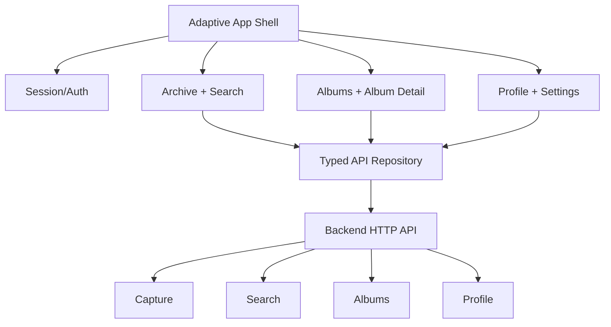

# Design Document: Polished Adaptive App

## Overview

The client will be organized around one adaptive shell and typed repository boundary. The shell owns authentication, navigation, global capture, and responsive layout. Each primary surface owns its loading/error/empty states and delegates network work to the existing repository interfaces. The visual system remains the documented neobrutalist emerald world, but all Material defaults that conflict with it are explicitly themed or replaced with reusable components.

The implementation prioritizes end-to-end behavior before decorative detail: capture, archive/search, detail actions, album CRUD/membership, profile/session, and resilient recovery. Cortex media analysis is not implemented; pending/partial/failed/complete statuses are displayed from API data.

## Architecture



## Components and Interfaces

### Component 1: Adaptive App Shell

**Purpose**: Provide responsive navigation and shared capture affordance.

**Responsibilities**:
- Restore session before loading protected content.
- Render bottom navigation only on compact widths and rail only on expanded widths.
- Keep navigation destinations stable while presenting album detail as a route.
- Provide global error/snackbar feedback and a strong capture action.

### Component 2: Design System

**Purpose**: Make the visual contract reusable and consistent.

**Responsibilities**:
- Define color, typography, spacing, border, shadow, focus, and state tokens.
- Provide `BrutalSurface`, `BrutalistButton`, status chips, empty/error panels, and skeleton/loading treatments.
- Ensure minimum touch targets, semantics, and pressed states.

### Component 3: Repository Boundary

**Purpose**: Isolate HTTP and response normalization from widgets.

**Interface**:

```dart
abstract interface class AppRepository {
  Future<List<SavedPost>> listPosts({String? query});
  Future<CaptureReceipt> capture(String url, {String? idempotencyKey});
  Future<SavedPost> getPost(String id);
  Future<void> removePost(String id);
}
```

**Responsibilities**:
- Apply auth headers and bounded timeouts.
- Normalize list/envelope response shapes.
- Convert backend errors into actionable `ApiException`s.
- Avoid leaking profile data through debug logging.

### Component 4: Archive and Detail

**Purpose**: Let users scan, search, inspect, and act on saved posts.

**Responsibilities**:
- Debounce search and retain previous data while refreshing.
- Render text/media fallback cards with provenance and analysis state.
- Present source URL, AI-generated labeling, tags, albums, delete, and membership actions.

### Component 5: Albums and Profile Surfaces

**Purpose**: Complete organization and account flows.

**Responsibilities**:
- Load and filter albums with explicit states.
- Route album detail without embedding global navigation.
- Create albums, add/remove posts, and refresh after mutation.
- Load profile with retry and sign-out behavior.

## Data Models

Existing domain models remain the source of truth: `SavedPost`, `Album`, `AlbumDetail`, `UserProfile`, `LoadState`, `CaptureReceipt`. JSON parsing must tolerate nullable/missing optional fields while rejecting invalid required capture receipts.

## Error Handling

- **Offline/timeout**: Show a bounded, actionable error panel/snackbar with retry.
- **401/expired session**: Clear local session and return to sign-in rather than looping requests.
- **Validation**: Explain URL/query issues inline or in a snackbar while preserving input.
- **Empty**: Explain what is empty and offer the next relevant action.
- **Partial analysis**: Label unavailable details without blocking browsing.
- **Image failure**: Preserve card geometry and show a branded fallback.

## Testing Strategy

### Unit Testing Approach

Test URL validation, response normalization, status presentation, repository error mapping, album filtering, and session transitions.

### Integration Testing Approach

Use mocked HTTP clients for capture/search/albums/profile and backend API tests for route contracts. Widget tests cover compact/expanded navigation, empty/failure states, capture validation, detail actions, and sign-out.

### Correctness Properties

- Every major async operation reaches success, empty, failure, or retryable loading state.
- Every destructive action is labeled and recoverable via confirmation.
- Compact and expanded shells never render duplicate global navigation.
- API path/query values remain correctly encoded.

## Performance Considerations

Debounce search, keep bounded page sizes, avoid rebuilding the entire shell for card-level changes, use stable image dimensions, and dispose controllers/subscriptions. Network requests use timeouts.

## Security Considerations

Use secure session storage, bearer headers only for API requests, no personal debug logs, validate capture URLs client-side and server-side, and never expose private album metadata in public surfaces.

## Dependencies

Existing Flutter Material 3, HTTP, secure storage, Google sign-in/share-intent packages, and existing Bun/Elysia backend. No Cortex dependency is required for this client scope.
