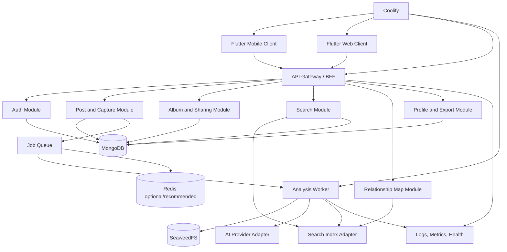

# Design Document: Saved Posts Memory

## Overview

Saved Posts Memory is an adaptive Flutter application backed by a self-hosted, containerized service platform. Flutter is selected over React Native plus a separate web UI because the product's primary surfaces are highly visual and gesture-rich, while Flutter provides one rendering model, one neobrutalist component system, shared animations, and consistent touch/keyboard semantics across iOS, Android, and web. The web target remains responsive and URL-addressable rather than being treated as a stretched mobile screen.

The backend uses a modular API and worker architecture. MongoDB stores account, post, album, membership, analysis, search metadata, and job records. SeaweedFS stores media and derivatives. Redis is optional but recommended for queue coordination, rate limiting, short-lived sessions, and cache invalidation. A Search_Service adapter isolates the selected self-hosted full-text/vector implementation so the application does not couple domain logic to a single search vendor. Gemini is accessed only through an AI provider adapter with prompt/version/provenance records.

The design divides implementation into four independent vertical workstreams: Client Experience, Capture and Library, Analysis and Search, and Albums/Sharing/Operations. Shared contracts are generated and versioned first; each workstream owns an isolated package/service boundary and consumes fixtures or mocked adapters until integration.

## Architecture



### Deployment topology

- `client-web`: Flutter web static artifact served by a minimal web container or Coolify static deployment.
- `api`: stateless HTTP API, OAuth callback endpoints, public-link endpoint, media authorization endpoint, and health endpoints.
- `worker`: analysis, media retrieval, frame extraction, transcription orchestration, embedding generation, search-index updates, cleanup, and organization suggestions.
- `scheduler`: optional worker mode for retry recovery, stale-job detection, retention cleanup, and metrics rollups.
- `mongodb`: primary application database with replica/backup strategy selected by deployment size.
- `seaweedfs-master`, `seaweedfs-volume`, `seaweedfs-filer`: media storage deployment; exact topology is configurable in Coolify.
- `redis`: recommended for queue leases, rate limits, cache invalidation, and ephemeral state; domain correctness must not depend on Redis durability.
- `search`: self-hosted search/vector engine behind `SearchIndex` and `SearchQuery` ports.

### Boundary rules

1. Flutter clients communicate only through generated API clients and local repositories; no client directly accesses MongoDB, SeaweedFS, Gemini, Redis, or the search engine.
2. API modules communicate through application ports and domain events, not direct cross-module collection queries.
3. Workers consume durable job records and use idempotency keys for every side effect.
4. Public album responses are generated from an explicit redacted projection, never by serializing private domain objects.
5. Search queries always include an authorization scope before retrieval.
6. Media URLs are short-lived or authenticated streams; object-store credentials never cross the API boundary.

### API conventions

- JSON over HTTPS for ordinary requests.
- OpenAPI 3.1 is the source of truth for HTTP contracts.
- RFC 9457-style problem details with stable `code`, `message`, `fieldErrors`, and `requestId`.
- Cursor pagination uses opaque base64url cursors containing a signed sort key and scope hash.
- Mutating endpoints accept `Idempotency-Key` where retries can duplicate effects.
- Every response includes a request identifier through a header and, where appropriate, body metadata.
- Dates use RFC 3339 UTC strings; IDs use opaque UUIDv7 or equivalent sortable opaque IDs.

## Components and Interfaces

### Component 1: Flutter Adaptive Client

**Purpose**: Provide one product experience across iOS, Android, and web while adapting navigation, input, layout, and interaction to the platform.

**Interface**:

```dart
abstract interface class AppRepository {
  Future<Page<SavedPost>> listPosts(PostQuery query);
  Future<SavedPost> capture(CaptureDraft draft);
  Future<PostDetail> getPost(PostId id);
  Future<SearchPage> search(SearchQuery query);
  Future<AlbumPage> listAlbums(AlbumQuery query);
}

abstract interface class ShareIntentSource {
  Stream<SharedLink> get incomingLinks;
}

abstract interface class SyncOutbox {
  Future<void> enqueue(CaptureDraft draft);
  Stream<OutboxEntry> watch();
}
```

**Responsibilities**:

- Render Home, Albums, Album Detail, Search, Post Detail, Relationship Map, Profile, Auth, and public Album surfaces.
- Maintain route state, selection state, optimistic UI boundaries, local outbox, and accessibility semantics.
- Use responsive breakpoints based on available width and input capability rather than device names.
- Expose accessible alternatives for long press, drag, pan/zoom, and gesture-only actions.
- Consume fixtures and generated clients, never backend implementation details.

**Package boundary**:

```text
client/
  lib/app/                 # routing, auth shell, responsive scaffold
  lib/core/                # result types, IDs, environment, accessibility
  lib/design_system/       # neobrutalist tokens, primitives, motion
  lib/features/home/       # gallery and post selection
  lib/features/albums/     # album grid and album detail
  lib/features/search/     # search and suggestions
  lib/features/post_detail/
  lib/features/map/
  lib/features/profile/
  lib/features/public_album/
  lib/data/                # generated API, repositories, local outbox
```

### Component 2: API Gateway and Application Modules

**Purpose**: Authenticate requests, enforce authorization, validate commands, coordinate domain services, and expose stable contracts.

**Interface**:

```typescript
interface PostApplication {
  capture(command: CaptureCommand, scope: OwnerScope): Promise<CaptureResult>;
  list(query: PostListQuery, scope: OwnerScope): Promise<PostPage>;
  get(id: PostId, scope: OwnerScope): Promise<PostDetail>;
  delete(ids: PostId[], scope: OwnerScope): Promise<DeleteResult>;
}

interface SearchApplication {
  search(query: SearchQuery, scope: OwnerScope): Promise<SearchPage>;
  suggest(query: SuggestionQuery, scope: OwnerScope): Promise<TagSuggestion[]>;
}
```

**Responsibilities**:

- Verify Google OAuth tokens and issue application sessions.
- Construct `OwnerScope` before invoking protected application methods.
- Enforce validation, idempotency, cursor scope, rate limits, and transaction boundaries.
- Publish durable domain events or analysis jobs after accepted mutations.
- Return redacted DTOs and stable problem details.

**Module layout**:

```text
server/api/src/modules/
  auth/
  capture/
  posts/
  albums/
  search/
  map/
  public-albums/
  profile/
  common/
```

### Component 3: Capture Service

**Purpose**: Normalize links, identify providers, retrieve permitted metadata, and create idempotent Saved_Post records.

**Interface**:

```typescript
interface CaptureService {
  normalize(rawUrl: string): Result<CanonicalUrl, CaptureValidationError>;
  capture(command: CaptureCommand, scope: OwnerScope): Promise<CaptureResult>;
  refreshSource(postId: PostId, scope: OwnerScope): Promise<RefreshResult>;
}

interface SourceAdapter {
  supports(url: CanonicalUrl): boolean;
  resolve(input: ResolveInput): Promise<ResolvedSource>;
}
```

**Responsibilities**:

- Normalize known provider URL variants.
- Select a provider adapter without allowing provider code to bypass authorization.
- Create one post per owner/canonical URL using a unique index and idempotency record.
- Preserve source URL and capture event even when media resolution is unavailable.
- Enqueue analysis only after the post version is committed.

### Component 4: Analysis Pipeline

**Purpose**: Process media and text asynchronously into durable, provenance-aware derived data.

**Interface**:

```typescript
interface AnalysisOrchestrator {
  enqueue(postId: PostId, version: number, reason: AnalysisReason): Promise<JobId>;
  process(job: AnalysisJob): Promise<AnalysisOutcome>;
  retry(jobId: JobId, scope: OwnerScope): Promise<JobStatus>;
}

interface MediaStore {
  put(input: MediaPut): Promise<StoredAsset>;
  createAuthorizedRead(assetId: AssetId, scope: ReadScope): Promise<AuthorizedMediaRead>;
  delete(assetId: AssetId, scope: OwnerScope): Promise<void>;
}

interface AiProvider {
  describeImage(input: ImagePrompt): Promise<GeneratedDescription>;
  transcribe(input: AudioPrompt): Promise<Transcript>;
  embed(input: EmbeddingInput): Promise<EmbeddingVector>;
}
```

**Responsibilities**:

- Use a staged state machine: fetch, store, extract, describe/transcribe, embed, persist, index.
- Persist each stage result independently so partial completion is useful.
- Bound retries and distinguish transient from permanent provider failures.
- Include provider/model/prompt version and timestamps with generated fields.
- Ensure all worker side effects are idempotent by `(postId, postVersion, stage)`.

### Component 5: Search Adapter and Search Application

**Purpose**: Combine semantic, lexical, tag, and structured filtering while maintaining owner scope.

**Interface**:

```typescript
interface SearchIndex {
  upsert(document: SearchDocument): Promise<void>;
  delete(documentId: string): Promise<void>;
  query(request: ScopedSearchRequest): Promise<RawSearchHit[]>;
}

interface SearchRanker {
  rank(query: SearchIntent, hits: RawSearchHit[]): RankedPost[];
}
```

**Responsibilities**:

- Build documents from authorized post projections.
- Keep index updates replayable from MongoDB analysis state.
- Apply filters before or during retrieval as supported by the engine.
- Use Gemini for intent extraction or query expansion only within explicit time and token budgets.
- Fall back to deterministic lexical/vector search when AI is unavailable.
- Return relevance explanations without revealing hidden fields.

### Component 6: Album and Organization Service

**Purpose**: Manage user collections, suggestions, and explicit or automatic membership changes.

**Interface**:

```typescript
interface AlbumService {
  create(command: CreateAlbumCommand, scope: OwnerScope): Promise<Album>;
  update(command: UpdateAlbumCommand, scope: OwnerScope): Promise<Album>;
  addMembers(command: AddMembersCommand, scope: OwnerScope): Promise<MembershipResult>;
  removeMembers(command: RemoveMembersCommand, scope: OwnerScope): Promise<MembershipResult>;
  suggest(albumId: AlbumId, scope: OwnerScope): Promise<OrganizationSuggestion[]>;
}
```

**Responsibilities**:

- Preserve membership idempotence and independent post deletion semantics.
- Generate suggestions separately from applying memberships.
- Maintain Auto_Organization rules and audit reasons.
- Provide album cover selection and ordered membership projections.

### Component 7: Public Album Projection

**Purpose**: Publish safe, read-only album views through revocable links.

**Interface**:

```typescript
interface PublicAlbumService {
  enable(albumId: AlbumId, options: ShareOptions, scope: OwnerScope): Promise<PublicLink>;
  revoke(albumId: AlbumId, scope: OwnerScope): Promise<void>;
  getByToken(token: string): Promise<PublicAlbumProjection | NotFound>;
}
```

**Responsibilities**:

- Generate high-entropy tokens stored hashed at rest.
- Redact user identity, private tags, internal identifiers, and unauthorized assets.
- Invalidate cached projections on revoke, album deletion, or privacy changes.
- Keep public link access read-only and rate-limited.

### Component 8: Relationship Map Service

**Purpose**: Produce bounded semantic graph data and an equivalent accessible list projection.

**Interface**:

```typescript
interface RelationshipMapService {
  getGraph(query: GraphQuery, scope: OwnerScope): Promise<GraphProjection>;
  getList(query: GraphQuery, scope: OwnerScope): Promise<GraphListProjection>;
}
```

**Responsibilities**:

- Build nodes from authorized posts, tags, albums, and source platforms.
- Build typed edges from shared tags, semantic similarity, album membership, and metadata.
- Cluster or sample large graphs deterministically.
- Return enough explanation metadata for accessible list views.

### Component 9: Coolify Deployment and Operations

**Purpose**: Operate the system as reproducible self-hosted services.

**Interface**:

```text
GET /health/live
GET /health/ready
GET /metrics
POST /internal/jobs/reconcile (operator-authenticated)
```

**Responsibilities**:

- Build and deploy containers through Coolify.
- Supply environment-specific configuration and secrets.
- Expose readiness checks, structured logs, metrics, backup procedures, and migrations.
- Keep client builds pointed at the configured API origin.

## Data Models

### Account and Session

```typescript
interface Account {
  id: AccountId;
  googleSubject: string;
  email: string;
  displayName?: string;
  avatarUrl?: string;
  createdAt: Instant;
  updatedAt: Instant;
  deletedAt?: Instant;
}

interface Session {
  id: SessionId;
  accountId: AccountId;
  tokenHash: string;
  expiresAt: Instant;
  revokedAt?: Instant;
  createdAt: Instant;
  lastSeenAt: Instant;
}
```

Validation: Google subject and email are verified provider values; token material is never stored in plaintext; deleted accounts cannot create sessions.

### Saved Post

```typescript
interface SavedPost {
  id: PostId;
  ownerId: AccountId;
  canonicalUrl: string;
  platform: SourcePlatform;
  sourceAuthor?: SourceAuthor;
  sourceTitle?: string;
  sourceText?: string;
  capturedAt: Instant;
  updatedAt: Instant;
  analysisStatus: AnalysisStatus;
  analysisVersion: number;
  deletionState: 'active' | 'deleted';
  deletedAt?: Instant;
  media: MediaAssetRef[];
  generated: GeneratedPostData;
}

interface GeneratedPostData {
  description?: GeneratedField<string>;
  tags: GeneratedField<TagValue>[];
  transcript?: GeneratedField<Transcript>;
  embeddings: EmbeddingRef[];
  provenance: AnalysisProvenance[];
}
```

Indexes: unique `(ownerId, canonicalUrl, deletionState)` strategy; descending `(ownerId, capturedAt, id)`; analysis status; platform; tag references; deletion state.

### Media Asset

```typescript
interface MediaAssetRef {
  id: AssetId;
  ownerId: AccountId;
  postId: PostId;
  kind: 'image' | 'video' | 'frame' | 'audio' | 'thumbnail';
  mimeType: string;
  byteSize: number;
  checksum: string;
  storageKey: string;
  frameTimestampMs?: number;
  availability: 'available' | 'blocked' | 'failed' | 'deleted';
  createdAt: Instant;
}
```

Validation: MIME allowlist, configured byte/duration limits, owner consistency, storage key opacity, checksum required for stored content.

### Album and Membership

```typescript
interface Album {
  id: AlbumId;
  ownerId: AccountId;
  name: string;
  description?: string;
  visibility: 'private' | 'public';
  coverPostId?: PostId;
  createdAt: Instant;
  updatedAt: Instant;
  deletedAt?: Instant;
}

interface AlbumMembership {
  albumId: AlbumId;
  postId: PostId;
  ownerId: AccountId;
  position: number;
  addedBy: 'user' | 'suggestion' | 'auto_rule' | 'search_action';
  reason?: string;
  addedAt: Instant;
}
```

Unique index `(albumId, postId)`; membership and post owner must match; position updates are transactional or versioned.

### Search Documents and Query

```typescript
interface SearchDocument {
  documentId: string;
  ownerId: AccountId;
  postId: PostId;
  text: string;
  tags: string[];
  platform: SourcePlatform;
  albumIds: AlbumId[];
  capturedAt: Instant;
  mediaKinds: string[];
  analysisStatus: AnalysisStatus;
  embedding?: number[];
  indexVersion: number;
}

interface SearchQuery {
  rawQuery: string;
  filters: SearchFilters;
  cursor?: string;
  limit: number;
}
```

Search documents are derived and replayable; they are never the authoritative source of ownership or deletion state.

### Analysis Job

```typescript
interface AnalysisJob {
  id: JobId;
  postId: PostId;
  ownerId: AccountId;
  postVersion: number;
  stage: AnalysisStage;
  status: 'queued' | 'processing' | 'retryable' | 'completed' | 'failed';
  attempts: number;
  idempotencyKey: string;
  nextAttemptAt?: Instant;
  lastError?: SafeError;
  createdAt: Instant;
  updatedAt: Instant;
}
```

Unique idempotency key prevents duplicate stage side effects; leases expire and are reclaimable.

### Public Album Link

```typescript
interface PublicAlbumLink {
  id: PublicLinkId;
  albumId: AlbumId;
  ownerId: AccountId;
  tokenHash: string;
  status: 'active' | 'revoked';
  createdAt: Instant;
  revokedAt?: Instant;
}
```

Only token hashes are stored; raw tokens are shown once to the owner through HTTPS and never logged.

### Relationship Graph

```typescript
interface GraphProjection {
  nodes: GraphNode[];
  edges: GraphEdge[];
  generatedAt: Instant;
  truncated: boolean;
  nextCursor?: string;
}

interface GraphNode {
  id: string;
  kind: 'post' | 'tag' | 'album' | 'platform';
  label: string;
  postId?: PostId;
  albumId?: AlbumId;
  tag?: string;
}

interface GraphEdge {
  source: string;
  target: string;
  kind: 'shared_tag' | 'semantic' | 'album_membership' | 'source';
  weight: number;
  explanation?: string;
}
```

## Correctness Properties

A property is a characteristic or behavior that should hold across all valid executions of a system. Properties bridge human-readable requirements and machine-verifiable correctness guarantees. The following properties target pure domain logic and adapter boundaries; UI rendering and external provider behavior use example-based, integration, snapshot, and accessibility tests instead.

1. **URL normalization idempotence** — For every supported or unsupported URL string that parses successfully, normalizing the normalized output produces the same Canonical_Post_URL. Validates 2.2 and 14.5.
2. **Capture idempotence** — For every Owner and Canonical_Post_URL, repeating an accepted capture with the same idempotency key produces one active Saved_Post identity. Validates 2.3, 2.6, and 11.2.
3. **Membership idempotence** — For every valid Album and Saved_Post pair, adding the same membership repeatedly leaves one membership and does not alter unrelated memberships. Validates 6.5 and 14.5.
4. **Membership removal isolation** — Removing a membership changes album membership only and preserves the Saved_Post and every other Album membership. Validates 6.6.
5. **Cursor stability** — For every ordered post fixture and valid cursor, concatenating pages yields each eligible post once in the server sort order. Validates 5.5 and 7.10.
6. **Authorization non-expansion** — For every Owner scope and any query, all returned private post, album, asset, graph, and search records belong to that scope. Validates 1.5, 1.6, 3.7, 7.11, and 9.1.
7. **Public projection separation** — For every private Album fixture, its public projection contains only allowlisted fields and cannot contain owner identity, private tags, internal object keys, or unrelated posts. Validates 8.2 and 8.3.
8. **Soft-delete exclusion** — For every deleted Saved_Post, ordinary post listing, album projection, and search document query exclude the post while export and retention workflows can still identify it by authorized administrative state. Validates 5.12, 7.11, and 13.2.
9. **Analysis stage convergence** — For every replay of the same `(postId, postVersion, stage)` job, the persisted stage has one logical result and repeated indexing does not create duplicate search documents. Validates 4.1, 4.5, and 4.7.
10. **Search filter composition** — For every result set and conjunction of valid filters, every result satisfies every selected filter; clearing one filter cannot add a result that violates the remaining filters. Validates 7.2 and 7.3.
11. **Graph authorization and referential integrity** — Every graph edge references nodes present in the same projection, and every node is Owner-authorized. Validates 9.1 and 9.2.
12. **Outbox at-most-once reconciliation** — For every queued capture request retried any number of times, successful reconciliation produces one Saved_Post identity and a terminal outbox state. Validates 11.1 and 11.2.

## Error Handling

### Authentication and authorization

Return `401` for absent/expired sessions and `403` for authenticated users lacking ownership. Use generic public-link `404` responses for revoked/private/missing tokens. Never include whether another user owns a requested resource.

### Validation

Return `400` with field-level errors for malformed URLs, invalid album names, unsupported filters, invalid cursors, and out-of-range pagination limits. The client highlights the field and preserves user input.

### Capture and provider errors

Return an accepted post with explicit `sourceOnly`, `blocked`, or `unsupported` analysis state when source metadata or media cannot be retrieved. Do not turn provider failure into a fake success or discard the source URL.

### Analysis errors

Persist stage-specific safe errors, retry transient failures with bounded exponential backoff, and stop after a configured attempt count. The UI exposes retry without requiring the user to recapture the post.

### Search errors

If AI query understanding fails, use deterministic retrieval. If the search engine is unavailable, return a typed degraded-service response with recent cached results only when freshness is known; otherwise return retryable error state.

### Storage errors

If SeaweedFS fails after MongoDB capture commit, retain the post and enqueue storage recovery. Never expose a broken permanent media URL as available.

### Conflicts and concurrency

Use optimistic version checks for album rename, membership reorder, public-link state, and profile changes. Return `409` with the current version and a client-resolvable conflict code.

### Client recovery

All major surfaces implement loading, empty, partial, offline, error, and retry states. The local outbox preserves capture drafts; destructive actions require confirmation and provide undo where safe.

## Testing Strategy

### Unit Testing Approach

- Server: Vitest or equivalent for URL canonicalization, validation, authorization scopes, cursor encoding, idempotency, DTO redaction, ranking composition, graph capping, and job state transitions.
- Flutter: `flutter_test` for repositories, reducers/notifiers, route state, selection mode, responsive layout breakpoints, semantics, motion preference, and offline outbox reconciliation.
- Target coverage: 90% for pure domain logic; 80% for API application modules; every error branch in authorization, capture, public projection, and job orchestration.

### Property-Based Testing Approach

**Property Test Library**: `fast-check` for TypeScript server logic and `package:glados` or a maintained Dart property-testing library for Flutter domain packages.

Use properties listed above for pure transformations, scope, ordering, idempotency, projections, and state transitions. Do not property-test Gemini, social platforms, MongoDB, SeaweedFS, or the search engine itself; use mocks and representative integration tests.

### Integration Testing Approach

- MongoDB repository tests with disposable containers.
- SeaweedFS media put/read/delete tests with disposable storage.
- Search adapter contract tests against the selected engine.
- OAuth test using a fake Google identity provider and real session issuance.
- End-to-end capture-to-analysis-to-search test using fake source adapters and fake AI provider.
- Public-link revocation and redaction tests.
- Coolify-like compose smoke test that starts API, worker, database, object storage, Redis, and search services.

### Client and visual testing

- Golden tests for design tokens, gallery cards, album grid, detail sheet, search states, public album, and responsive layouts at 320, 390, 768, 1024, and 1440 logical pixels.
- Integration tests for share intent, long-press plus accessible selection, add-to-album, delete confirmation, search-to-album, public-link copy, and map/list parity.
- Automated accessibility semantics tests and web keyboard traversal.
- Manual device matrix: iOS compact, Android compact, mobile web, tablet, desktop web; reduced-motion and high-contrast settings.

## Performance Considerations

- Cursor pagination and thumbnail derivatives prevent full-library payloads.
- Gallery media uses lazy loading, bounded decode dimensions, prefetch windows, and cancellation on scroll reversal.
- Search requests debounce interactive suggestions and enforce query budgets.
- Relationship graphs are capped, clustered, and progressively loaded.
- Analysis workers use bounded concurrency per provider and per Owner to avoid noisy-neighbor effects.
- Media delivery uses byte ranges for video where supported and CDN-like caching only for authorized short-lived URLs.
- Target p95 API list/search response under 500 ms for warm indexed requests; capture acknowledgement under 2 seconds; first gallery content under 2 seconds on representative broadband after authentication.

## Security Considerations

- Google OAuth authorization-code/PKCE appropriate to platform; validate issuer, audience, nonce, and subject.
- HttpOnly secure cookies for web sessions where possible; platform secure storage for mobile tokens.
- Hash public-link tokens and session tokens at rest.
- Enforce Owner scope in application services and repository methods, not only route handlers.
- Sanitize source text and generated text before web rendering; never render arbitrary HTML from social platforms.
- SSRF protection for source/media retrieval: provider allowlist, DNS/IP checks, redirect limits, timeouts, size limits, and sandboxed workers.
- Malware/content-type checks and decompression-bomb protections for media.
- Encrypt transport; document at-rest encryption assumptions for MongoDB and SeaweedFS deployment.
- Redact tokens, signed URLs, raw prompts containing private content, and private source data from logs.
- Rate-limit expensive capture, analysis retry, search-agent, public-link, and authentication operations.
- Provide deletion, export, retention, and provider-processing controls.

## Dependencies

### Client

- Flutter stable channel with adaptive web/mobile support.
- Riverpod or an equivalent explicitly selected state-management library.
- `go_router` or equivalent typed routing.
- Generated OpenAPI client.
- Mingcute filled SVG icon assets.
- Image/video playback and share-intent packages evaluated for iOS, Android, and web compatibility.

### Server and workers

- TypeScript Node.js API and worker runtime, or an equivalent runtime selected before implementation; shared OpenAPI schemas remain language-neutral.
- MongoDB driver/ODM.
- SeaweedFS S3-compatible client.
- Redis client and durable queue library if Redis is enabled.
- OpenAPI generator, schema validation library, structured logging, metrics, and tracing libraries.
- FFmpeg for video metadata and frame extraction, subject to licensing and deployment review.
- Gemini SDK through an internal provider adapter.
- Selected self-hosted full-text/vector search engine behind `SearchIndex`.

### Operations

- Docker/OCI build tooling.
- Coolify deployment configuration.
- MongoDB and SeaweedFS backup tooling.
- Disposable test containers and CI runner.
