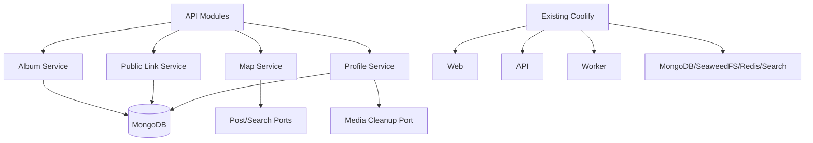

# Design Document: Albums, Sharing, Relationship Map, and Operations

## Overview

This workstream owns collection management and the operational layer around saveyour.tech. Albums use MongoDB as the authoritative source for names, visibility, memberships, ordering, suggestions, and audit records. Public links are separate hashed tokens mapped to redacted projections. The relationship map consumes authorized post/search summaries through ports and returns both a visual graph projection and an accessible list projection.

Coolify is an existing deployment platform. The design provides deployable service definitions, environment configuration, health checks, persistent storage requirements, backup/restore procedures, and operational documentation without provisioning Coolify itself.

## Architecture



## Components and Interfaces

### Album service

```typescript
interface AlbumService {
  create(command: CreateAlbumCommand, scope: OwnerScope): Promise<Album>;
  update(command: UpdateAlbumCommand, scope: OwnerScope): Promise<Album>;
  addMembers(command: AddMembersCommand, scope: OwnerScope): Promise<MembershipResult>;
  removeMembers(command: RemoveMembersCommand, scope: OwnerScope): Promise<MembershipResult>;
  suggest(albumId: AlbumId, scope: OwnerScope): Promise<OrganizationSuggestion[]>;
}
```

Membership unique key is `(albumId, postId)`. Post and album Owner IDs must match. Position updates use optimistic versions and deterministic tie-breakers.

### Organization service

Consumes search summaries through a port. Suggestions are separate records with confidence, reason, and generation version. Applying a suggestion is explicit unless an enabled Auto_Organization rule authorizes the mutation. Every automatic mutation records rule ID and reason.

### Public link service

```typescript
interface PublicAlbumService {
  enable(albumId: AlbumId, options: ShareOptions, scope: OwnerScope): Promise<PublicLink>;
  revoke(albumId: AlbumId, scope: OwnerScope): Promise<void>;
  getByToken(token: string): Promise<PublicAlbumProjection | NotFound>;
}
```

Generate high-entropy raw tokens, store only hashes, and construct allowlisted public DTOs. Cache keys include token hash and are invalidated on all visibility/link state changes.

### Map service

```typescript
interface RelationshipMapService {
  getGraph(query: GraphQuery, scope: OwnerScope): Promise<GraphProjection>;
  getList(query: GraphQuery, scope: OwnerScope): Promise<GraphListProjection>;
}
```

Build bounded typed nodes/edges from post, tag, album, platform, and search ports. Deterministic clustering/sampling ensures repeatable output.

### Profile service

Creates export/deletion jobs. Deletion revokes sessions and links, removes/anonymizes metadata, and schedules media cleanup through a port. Export contains only authorized documented fields.

### Coolify deployment

Compose/OCI definitions are service-oriented and parameterized for an existing Coolify instance. Persistent volumes are explicitly named. Readiness checks validate MongoDB, SeaweedFS, Redis, SearchIndex, API, worker, and web configuration. No Coolify installation logic is included.

## Data Models

```typescript
interface Album { id; ownerId; name; description?; visibility; coverPostId?; createdAt; updatedAt; deletedAt? }
interface AlbumMembership { albumId; postId; ownerId; position; addedBy; reason?; addedAt }
interface OrganizationRule { id; ownerId; albumId; mode; query; enabled; createdAt; updatedAt }
interface OrganizationSuggestion { id; albumId; postId; score; reason; confidence; generation; status }
interface PublicAlbumLink { id; albumId; ownerId; tokenHash; status; createdAt; revokedAt? }
interface GraphProjection { nodes; edges; generatedAt; truncated; nextCursor? }
interface ExportJob { id; ownerId; status; objectRef?; createdAt; completedAt? }
interface DeletionJob { id; ownerId; status; revokedAt; cleanupState; createdAt; completedAt? }
```

## Correctness Properties

1. Adding a membership repeatedly produces one membership.
2. Removing one membership preserves the post and unrelated memberships.
3. Public projection contains only allowlisted fields.
4. Revoked/regenerated tokens cannot retrieve the prior projection.
5. Every graph edge references a node in the same authorized projection.
6. Every graph node is Owner-authorized.
7. Deleting an album does not delete Saved_Post records.
8. Account deletion revokes every public link and session.
9. Re-running deployment initialization is idempotent.

## Error Handling

Use field errors for album validation, conflict responses for stale versions, generic public not-found for private/revoked links, retryable status for graph/export/deletion failures, and explicit dependency health failures. Never expose internal object keys or identity data through public responses.

## Testing Strategy

- Unit/property tests for membership idempotence/isolation, ordering, organization rules, public redaction, token lifecycle, graph referential integrity, and deletion semantics.
- MongoDB integration tests for albums, memberships, suggestions, links, export, and deletion jobs.
- Public API integration tests as signed-out visitor.
- Graph tests for cap, clustering, list parity, empty, and unauthorized records.
- Deployment smoke tests for fresh containers, readiness failures, migrations, backups, persistent volume mounts, and existing-Coolify configuration.

## Performance Considerations

Batch membership changes, index Owner/album/post fields, cache public read projections with explicit invalidation, cap graph payloads, stream export archives, and schedule cleanup jobs. Public links and expensive suggestion/map operations are rate-limited.

## Security Considerations

Hash public tokens, enforce Owner scope, redact public DTOs, rate-limit public access and export/deletion, protect object-store references, restrict operator endpoints, avoid secrets in logs, and ensure Coolify environment variables/secrets are not committed.

## Dependencies

MongoDB, SeaweedFS cleanup port, search/post summary ports, optional Redis cache/queue, HTTP/OpenAPI tooling, container runtime, Coolify service configuration, backup utilities, metrics, structured logs, and disposable integration containers.
