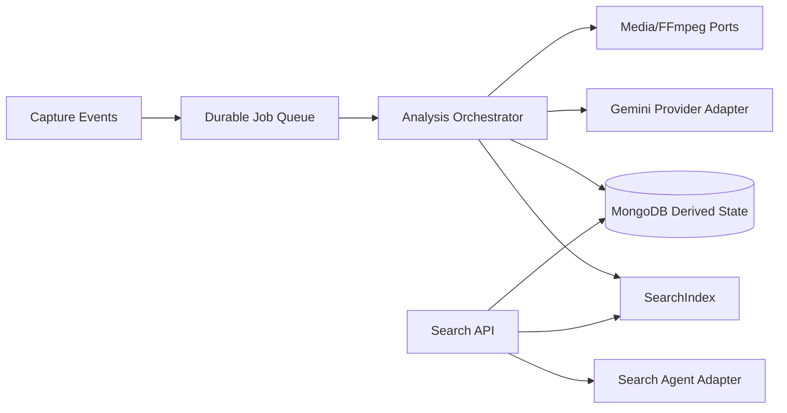

# Design Document: Analysis Pipeline, Media Intelligence, and Search

## Overview

The analysis workstream is a durable worker system that consumes accepted Saved_Post versions and produces provenance-aware derived fields and search documents. It uses staged, replayable jobs so media retrieval, frame extraction, AI generation, embedding, and indexing can fail independently without discarding source content.

Search is isolated behind an engine-neutral adapter. The implementation selects one self-hosted full-text/vector engine through a short evaluation spike, while the application depends only on `SearchIndex` and query/ranking interfaces.

## Architecture



## Components and Interfaces

### Job orchestration

```typescript
interface AnalysisOrchestrator {
  enqueue(postId: PostId, version: number, reason: AnalysisReason): Promise<JobId>;
  process(job: AnalysisJob): Promise<AnalysisOutcome>;
  retry(jobId: JobId, scope: OwnerScope): Promise<JobStatus>;
}
```

Each stage uses `(postId, version, stage)` as an idempotency key. Leases expire and can be reclaimed. Retryable and permanent errors are distinct.

### Media processing

FFmpeg is invoked through a sandboxed adapter with byte, duration, frame-count, and timeout limits. Frame assets are stored through the MediaStore port owned by the capture workstream. Audio transcripts include timestamps.

### AI provider

```typescript
interface AiProvider {
  describeImage(input: ImagePrompt): Promise<GeneratedDescription>;
  suggestTags(input: TagPrompt): Promise<TagValue[]>;
  transcribe(input: AudioPrompt): Promise<Transcript>;
  embed(input: EmbeddingInput): Promise<EmbeddingVector>;
  interpretQuery(input: QueryPrompt): Promise<SearchIntent>;
}
```

The Gemini adapter validates schemas, records model/prompt versions, applies budgets, and maps provider errors to safe retry states. A deterministic fake provider is required for tests.

### Search index

```typescript
interface SearchIndex {
  upsert(document: SearchDocument): Promise<void>;
  delete(documentId: string): Promise<void>;
  query(request: ScopedSearchRequest): Promise<RawSearchHit[]>;
  rebuild(cursor?: string): Promise<RebuildStatus>;
  health(): Promise<HealthStatus>;
}
```

`SearchApplication` constructs Owner scope before querying, combines AI intent with deterministic fallback, applies filters, ranks hits, and emits cursor-stable results.

## Data Models

```typescript
interface AnalysisJob {
  id; postId; ownerId; postVersion; stage;
  status; attempts; idempotencyKey; nextAttemptAt?; lastError?; createdAt; updatedAt;
}
interface AnalysisProvenance { provider; model; promptVersion?; generatedAt; confidence?; }
interface SearchDocument {
  documentId; ownerId; postId; text; tags; platform; albumIds;
  capturedAt; mediaKinds; analysisStatus; embedding?; indexVersion;
}
interface SearchQuery { rawQuery; filters; cursor?; limit; }
```

Derived fields are separate from original source fields. Search documents are rebuildable and never authoritative for deletion or ownership.

## Correctness Properties

1. Replaying one stage for one post version yields one logical persisted result.
2. Replaying index upsert yields one document version, not duplicates.
3. Every search hit belongs to the requested Owner scope.
4. Every result satisfies every selected filter.
5. Deleted or unauthorized documents never appear in results.
6. Concatenated search cursors preserve stable rank order.
7. A failed AI provider does not remove successful source/text/media results.
8. Rebuilding the index from authoritative fixtures produces equivalent documents.

## Error Handling

Persist stage-specific safe errors. Retry transient provider, queue, and storage failures with bounded backoff. Continue independent stages after malformed media. Fall back to lexical/vector search if AI query interpretation fails. Expose partial results and manual retry.

## Testing Strategy

- Unit/property tests for job convergence, retry transitions, filter composition, ranking tie-breakers, owner scope, cursor stability, and deletion exclusion.
- FFmpeg fixtures for valid image/video/audio, malformed media, large media, codec failure, and timeout.
- Fake Gemini provider tests for schema validation, provider failure, budget, provenance, and redaction.
- Search-engine contract tests for upsert, delete, vector, lexical, filters, health, and rebuild.
- End-to-end test: accepted post → job stages → derived state → index → semantic search.

## Performance Considerations

Bound provider concurrency per Owner, use queue leases, batch index updates where safe, store embeddings once per content version, and cap graph/search payloads. Query suggestions are debounced client-side and have strict token budgets.

## Security Considerations

Do not log prompts containing private source content, tokens, signed URLs, or raw provider credentials. Enforce Owner scope before search, cap provider input size, sandbox FFmpeg, validate generated output, and rate-limit expensive analysis/replay operations.

## Dependencies

Worker runtime, MongoDB repositories, optional Redis queue/lease adapter, FFmpeg, Gemini SDK through internal adapter, selected self-hosted full-text/vector search engine, schema validator, structured logging, metrics, and disposable integration containers.
