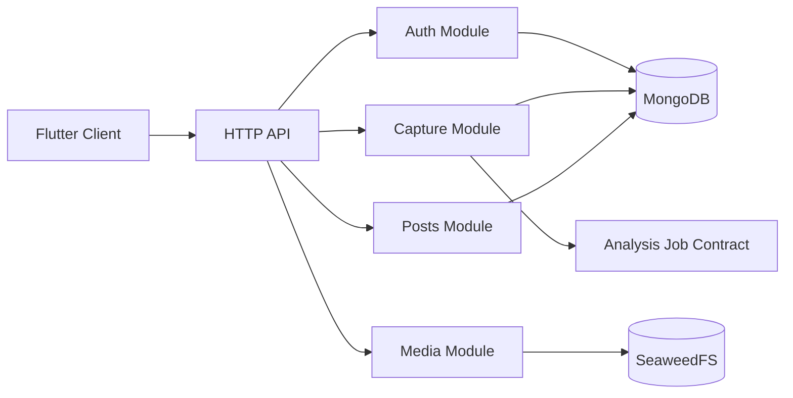

# Design Document: Capture, Posts, Media Storage, and Authentication

## Overview

This service is a stateless TypeScript API backed by MongoDB and SeaweedFS. It owns identity, session security, URL normalization, provider adapter selection, Saved_Post persistence, and authorized media access. It does not run AI analysis directly; accepted posts publish versioned events/jobs consumed by the Analysis workstream.

## Architecture



## Components and Interfaces

### Authentication module

Validates Google OAuth, maps provider subject to Account, creates hashed session records, revokes sessions, and constructs `OwnerScope`. Route middleware may reject requests, but repositories and application services must also require scope.

### Capture module

```typescript
interface CaptureService {
  normalize(rawUrl: string): Result<CanonicalUrl, CaptureError>;
  capture(command: CaptureCommand, scope: OwnerScope): Promise<CaptureResult>;
  refresh(postId: PostId, scope: OwnerScope): Promise<RefreshResult>;
}
interface SourceAdapter {
  supports(url: CanonicalUrl): boolean;
  resolve(input: ResolveInput): Promise<ResolvedSource>;
}
```

Provider adapters are allowlisted and cannot make arbitrary outbound requests. Capture commits the post before publishing analysis work.

### Posts module

Owns MongoDB repositories, cursor encoding, active/deleted projections, detail DTOs, and deletion events. The unique active identity is Owner plus Canonical_Post_URL.

### Media module

```typescript
interface MediaStore {
  put(input: MediaPut): Promise<StoredAsset>;
  authorizeRead(assetId: AssetId, scope: OwnerScope): Promise<AuthorizedRead>;
  markDeleted(assetId: AssetId, scope: OwnerScope): Promise<void>;
}
```

SeaweedFS is accessed through S3-compatible credentials kept in API secrets. Reads use signed short-lived URLs or authenticated proxy streaming.

## Data Models

```typescript
interface Account { id; googleSubject; email; displayName?; avatarUrl?; createdAt; updatedAt; deletedAt? }
interface Session { id; accountId; tokenHash; expiresAt; revokedAt?; createdAt; lastSeenAt }
interface SavedPost {
  id; ownerId; canonicalUrl; platform; sourceAuthor?; sourceTitle?; sourceText?;
  capturedAt; updatedAt; analysisStatus; analysisVersion; deletionState; deletedAt?;
  media: MediaAssetRef[];
}
interface MediaAssetRef {
  id; ownerId; postId; kind; mimeType; byteSize; checksum; storageKey;
  availability; createdAt; frameTimestampMs?
}
```

Indexes: unique active Owner/canonical URL, Owner/capture time/id, status, platform, deletion state. Media records include checksum, size, MIME type, and opaque storage reference.

## Correctness Properties

1. URL normalization is idempotent for every successfully parsed input.
2. Repeating a capture with the same Owner, canonical URL, and idempotency key creates one active post.
3. Cursor pages concatenate into the exact server order without duplicates.
4. Every protected result belongs to Owner_Scope.
5. Soft-deleted posts never appear in ordinary list/detail projections.
6. Repeated deletion is idempotent and does not alter unrelated records.
7. Media authorization cannot produce a URL for another Owner.
8. Publicly logged fields never contain tokens, credentials, or private signed URLs.

## Error Handling

Use stable problem codes for invalid URL, unsupported platform, duplicate capture, unauthorized, forbidden, media limit, blocked retrieval, provider timeout, storage unavailable, and conflict. Preserve source-only posts when retrieval fails. Use bounded outbound timeouts and SSRF checks. Return retryable state for transient storage/provider failures.

## Testing Strategy

- Unit/property tests for URL normalization, provider classification, cursor encoding, idempotency, owner scope, deletion, and problem mapping.
- MongoDB integration tests for indexes, projections, pagination, and deletion.
- SeaweedFS integration tests for put/read/checksum/cleanup and authorized access.
- Fake Google identity-provider tests for OAuth/session flows.
- Source adapter tests with representative provider fixtures and blocked/unsafe responses.
- OpenAPI contract tests and log-redaction tests.

## Performance Considerations

Use cursor pagination, projections, indexes, bounded source downloads, thumbnail references, and asynchronous media cleanup. Capture acknowledgement should not wait for full analysis. API p95 list/detail target is 500ms for warm data.

## Security Considerations

Validate OAuth issuer/audience/nonce/subject. Hash session and public tokens. Enforce scope in application and repository layers. Apply SSRF protections, redirect limits, media type/size limits, decompression protections, rate limits, secure transport, and safe logs.

## Dependencies

TypeScript runtime, HTTP framework, MongoDB driver/ODM, Google OAuth verifier, SeaweedFS S3 client, schema validator, OpenAPI tooling, structured logger, metrics, disposable test containers, and FFmpeg only through the worker boundary.
