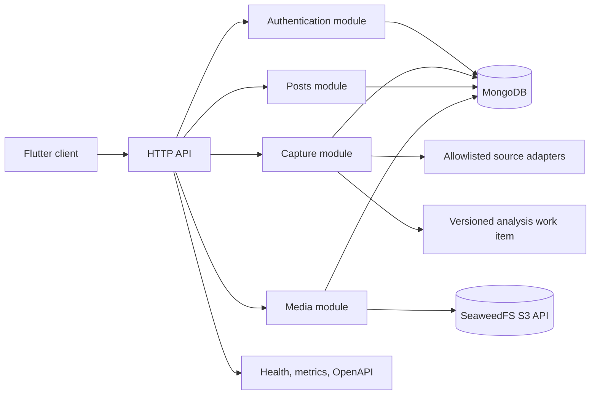
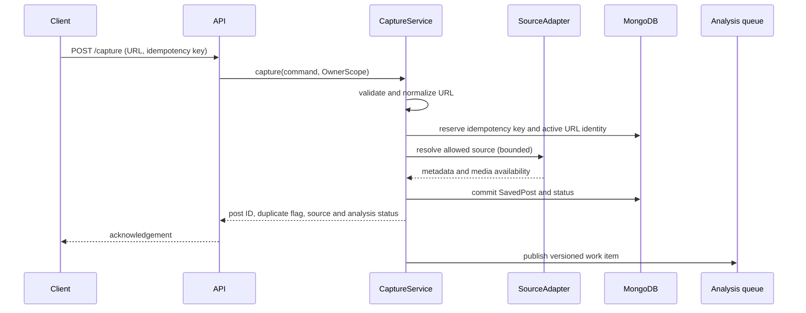
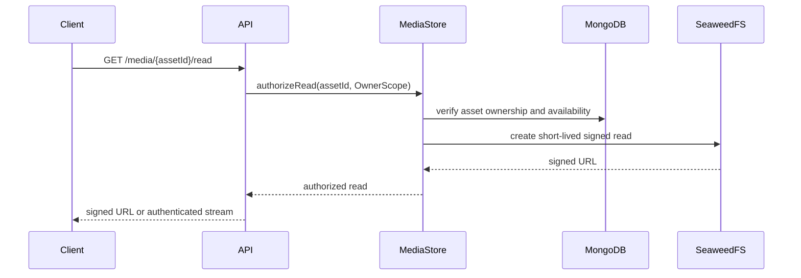

# Design Document: Capture, Posts, Media Storage, and Authentication

## Overview

The capture workstream is a stateless TypeScript HTTP API backed by MongoDB and SeaweedFS. It authenticates users with Google, normalizes and validates supported social-media URLs, creates owner-scoped Saved_Post records idempotently, retrieves permitted source metadata and media through constrained provider adapters, and exposes stable status to the Flutter client.

The API acknowledges capture after the durable Saved_Post and idempotency state are committed. Media retrieval and analysis are asynchronous. The workstream publishes versioned contracts and events but does not implement AI analysis. Repository and application boundaries both require Owner_Scope so authorization cannot depend solely on route middleware.

## Architecture



### Capture sequence



### Media authorization sequence



## Components and Interfaces

### Authentication module

**Purpose**: Verify Google authorization, maintain revocable sessions, and construct the Owner_Scope required by protected application services.

```pascal
INTERFACE AuthenticationService
  FUNCTION authorizeGoogle(input: GoogleAuthorization): Result[Session, AuthError]
  FUNCTION authenticate(sessionCredential: String): Result[OwnerScope, AuthError]
  PROCEDURE revoke(sessionId: SessionId): Result[Unit, AuthError]
END INTERFACE
```

**Responsibilities**:

- Verify issuer, audience, nonce, subject, email, and expiry.
- Upsert Account by immutable Google subject; do not merge accounts by email alone.
- Hash stored session credentials, enforce expiry, and support revocation.
- Return stable authentication problem codes without disclosing token details.

### URL normalization and validation

**Purpose**: Convert accepted provider URLs into a stable identity and reject malformed, unsupported, or unsafe destinations before persistence or outbound access.

```pascal
INTERFACE UrlPolicy
  FUNCTION normalize(rawUrl: String): Result[CanonicalPostUrl, UrlError]
  FUNCTION classify(url: CanonicalPostUrl): Result[SupportedPlatform, UrlError]
  FUNCTION validateRedirect(url: Url, policy: NetworkPolicy): Result[Unit, UrlError]
END INTERFACE
```

The normalizer uses an explicit provider grammar. It lowercases hostnames, removes fragments and approved tracking parameters, preserves provider-specific post identifiers, and rejects credentials, unexpected ports, local/private addresses, and unsupported hosts. Normalization is pure and idempotent.

### Capture module

**Purpose**: Coordinate idempotent capture, source resolution, persistence, and asynchronous work publication.

```pascal
INTERFACE CaptureService
  FUNCTION capture(command: CaptureCommand, scope: OwnerScope): Result[CaptureResult, CaptureError]
  FUNCTION refresh(postId: PostId, scope: OwnerScope): Result[CaptureResult, CaptureError]
END INTERFACE

STRUCTURE CaptureCommand
  rawUrl: String
  idempotencyKey: Optional[String]
END STRUCTURE

STRUCTURE CaptureResult
  postId: PostId
  duplicate: Boolean
  sourceStatus: SourceStatus
  analysisStatus: AnalysisStatus
END STRUCTURE
```

Capture reserves the `(ownerId, canonicalUrl)` identity and idempotency key in one transaction where MongoDB deployment supports transactions. A duplicate request returns the existing active post. The durable post commit precedes analysis event publication; an outbox record makes publication retryable.

### Source adapter registry

**Purpose**: Resolve supported URLs through provider-specific, allowlisted boundaries without permitting arbitrary network access.

```pascal
INTERFACE SourceAdapter
  FUNCTION supports(url: CanonicalPostUrl): Boolean
  FUNCTION resolve(input: ResolveInput): Result[ResolvedSource, ResolveError]
END INTERFACE

INTERFACE SourceAdapterRegistry
  FUNCTION adapterFor(url: CanonicalPostUrl): Result[SourceAdapter, UrlError]
END INTERFACE
```

Adapters receive a constrained HTTP client rather than unrestricted networking. The client validates every redirect, applies connection and response limits, rejects private-network destinations, caps decompression, and records only bounded safe failure reasons.

### Posts repository and API

**Purpose**: Persist Saved_Post records, provide owner-scoped projections and cursor pagination, and implement idempotent soft deletion.

```pascal
INTERFACE PostsRepository
  FUNCTION insert(post: SavedPost): Result[SavedPost, PersistenceError]
  FUNCTION findActiveByCanonicalUrl(scope: OwnerScope, url: CanonicalPostUrl): Result[Optional[SavedPost], PersistenceError]
  FUNCTION listActive(scope: OwnerScope, cursor: Optional[Cursor], limit: Integer): Result[PostPage, PersistenceError]
  FUNCTION getActive(scope: OwnerScope, postId: PostId): Result[Optional[SavedPost], PersistenceError]
  FUNCTION softDelete(scope: OwnerScope, postId: PostId): Result[DeletionResult, PersistenceError]
END INTERFACE
```

The API uses cursor pagination ordered by `(capturedAt DESC, postId DESC)`. Cursors are opaque, signed or authenticated, and encode the complete ordering tuple. Deleted records remain for retention and cleanup but are excluded from ordinary projections.

### Media module

**Purpose**: Validate, store, authorize, and asynchronously clean up Media_Assets.

```pascal
INTERFACE MediaStore
  FUNCTION put(input: MediaPut, scope: OwnerScope): Result[StoredAsset, MediaError]
  FUNCTION authorizeRead(assetId: AssetId, scope: OwnerScope): Result[AuthorizedRead, MediaError]
  FUNCTION markDeleted(assetId: AssetId, scope: OwnerScope): Result[Unit, MediaError]
  FUNCTION enqueueCleanup(ownerId: OwnerId): Result[Unit, MediaError]
END INTERFACE
```

The storage key is generated by the service and is never treated as a client-controlled path. SeaweedFS credentials remain server-side. Reads return a short-lived signed URL or an authenticated stream only after the asset owner, deletion state, and availability are checked.

### API and operations module

**Purpose**: Expose versioned HTTP contracts, request IDs, problem details, rate limits, health, metrics, and safe structured logging.

Required routes include:

- `GET/POST /auth/google`, `POST /auth/sign-out`
- `POST /capture`, `POST /posts/{postId}/refresh`
- `GET /posts`, `GET /posts/{postId}`, `DELETE /posts/{postId}`
- `GET /media/{assetId}/read`
- `GET /health`, `GET /metrics`, and published OpenAPI JSON

## Data Models

### Account and Session

```pascal
STRUCTURE Account
  id: AccountId
  googleSubject: String
  email: String
  displayName: Optional[String]
  avatarUrl: Optional[String]
  createdAt: Timestamp
  updatedAt: Timestamp
  deletedAt: Optional[Timestamp]
END STRUCTURE

STRUCTURE Session
  id: SessionId
  accountId: AccountId
  credentialHash: Hash
  expiresAt: Timestamp
  revokedAt: Optional[Timestamp]
  createdAt: Timestamp
  lastSeenAt: Timestamp
END STRUCTURE
```

Google subject is the stable identity key. Email is profile data and cannot be used as the account merge key. Session credentials are presented once to the client and stored only as hashes.

### Saved_Post

```pascal
STRUCTURE SavedPost
  id: PostId
  ownerId: AccountId
  canonicalUrl: CanonicalPostUrl
  platform: SupportedPlatform
  sourceAuthor: Optional[String]
  sourceTitle: Optional[String]
  sourceText: Optional[String]
  capturedAt: Timestamp
  updatedAt: Timestamp
  sourceStatus: SourceStatus
  analysisStatus: AnalysisStatus
  analysisVersion: Optional[String]
  media: List[MediaAssetRef]
  deletionState: DeletionState
  deletedAt: Optional[Timestamp]
END STRUCTURE
```

Indexes include a unique active `(ownerId, canonicalUrl)` identity, `(ownerId, capturedAt, id)` ordering, `(ownerId, deletionState)`, `(ownerId, analysisStatus)`, and `(ownerId, platform)`. A partial unique index or equivalent transaction rule excludes deleted posts from active identity conflicts.

### Media asset

```pascal
STRUCTURE MediaAsset
  id: AssetId
  ownerId: AccountId
  postId: PostId
  kind: MediaKind
  mimeType: String
  byteSize: Integer
  checksum: String
  storageRef: OpaqueStorageReference
  availability: MediaAvailability
  unavailableReason: Optional[String]
  createdAt: Timestamp
  deletedAt: Optional[Timestamp]
END STRUCTURE
```

Validation applies configured MIME allowlists, maximum bytes, checksum verification, owner metadata, and bounded download limits. `storageRef` is opaque and is not an object-store credential or unrestricted key.

### Versioned analysis work item

```pascal
STRUCTURE AnalysisWorkItemV1
  eventId: EventId
  schemaVersion: String
  postId: PostId
  ownerId: AccountId
  sourceSnapshot: SourceSnapshot
  mediaRefs: List[AssetId]
  requestedAt: Timestamp
END STRUCTURE
```

The event contains only the minimum data required by the analysis workstream and is safe to retry by `eventId`.

## Key Workflows

### Capture procedure

```pascal
PROCEDURE capture(command, scope)
  normalized ← UrlPolicy.normalize(command.rawUrl)
  IF normalized IS Error THEN
    RETURN normalized.error
  END IF

  platform ← UrlPolicy.classify(normalized.value)
  IF platform IS Error THEN
    RETURN platform.error
  END IF

  reservation ← IdempotencyRepository.reserve(scope.ownerId, command.idempotencyKey, normalized.value)
  IF reservation IS ExistingResult THEN
    RETURN reservation.result
  END IF

  existing ← PostsRepository.findActiveByCanonicalUrl(scope, normalized.value)
  IF existing IS Present THEN
    result ← duplicateResult(existing.value)
    IdempotencyRepository.commit(reservation, result)
    RETURN result
  END IF

  source ← SourceAdapterRegistry.adapterFor(normalized.value)
  resolved ← source.resolve(boundedInput(normalized.value))
  post ← buildSavedPost(scope, normalized.value, platform.value, resolved)
  persisted ← PostsRepository.insert(post)
  IF persisted IS Error THEN
    IdempotencyRepository.release(reservation)
    RETURN persisted.error
  END IF

  outbox.enqueue(buildAnalysisWorkItem(persisted.value))
  result ← acceptedResult(persisted.value)
  IdempotencyRepository.commit(reservation, result)
  RETURN result
END PROCEDURE
```

**Preconditions**: `scope` is authenticated; `command.rawUrl` is present; configured limits and repositories are available.

**Postconditions**: malformed or unsupported input creates no post; accepted input has one owner-scoped durable post; duplicate requests return the existing post; analysis publication is retryable; no client receives unrestricted storage credentials.

## Correctness Properties

A property is a behavior that must hold across all valid executions. Property-based tests apply to the pure normalization, cursor, idempotency, and authorization logic; external MongoDB, SeaweedFS, Google, and provider behavior uses focused integration tests.

1. **URL normalization idempotence** — For every valid provider URL `u`, `normalize(normalize(u)) = normalize(u)`. Validates Requirements 2.1, 2.6.
2. **Owner-scoped capture identity** — For every owner and canonical URL, repeated successful captures produce one active Saved_Post identity; captures by different owners remain independent. Validates Requirements 3.1–3.3.
3. **Idempotency replay** — For every accepted command with an idempotency key, replaying the same owner/key returns an equivalent result and does not create a second post or event. Validates Requirement 3.3.
4. **Cursor round trip and ordering** — For every valid page cursor, decoding the encoded cursor restores the same ordering tuple, and concatenated pages contain each active post exactly once in server order. Validates Requirement 4.2.
5. **Owner-scope projection** — For every protected repository operation, every returned post and asset has an owner equal to the authenticated Owner_Scope. Validates Requirements 1.5, 4.2, 4.3, 5.3.
6. **Deletion idempotence** — For every active post, applying soft deletion twice produces the same deleted state and leaves unrelated records unchanged. Validates Requirements 4.4–4.5.
7. **Redirect policy preservation** — For every retrieval redirect chain, if any target violates host or network policy, the chain returns a bounded failure and performs no request to the disallowed target. Validates Requirement 6.2.
8. **Contract serialization round trip** — For every valid versioned DTO fixture, serialization followed by deserialization produces an equivalent DTO, preserving the schema version. Validates Requirement 8.1.

## Error Handling

- **Authentication failure**: Return `AUTH_INVALID` or `AUTH_EXPIRED` with request ID; create no Session.
- **Malformed URL**: Return `URL_INVALID` with field-level details; create no Saved_Post.
- **Unsupported platform**: Return `PLATFORM_UNSUPPORTED` and list supported platform names.
- **Duplicate capture**: Return success with `duplicate: true` and the existing post ID.
- **Provider blocked or timeout**: Persist source identity and return `sourceStatus: limited` with a bounded reason; allow retry through refresh.
- **Media rejection**: Record `MEDIA_UNAVAILABLE` with a reason such as type, size, checksum, or retrieval policy.
- **Authorization failure**: Return `AUTH_REQUIRED` or `FORBIDDEN` without confirming another owner's resource existence.
- **Storage outage**: Return a retryable `STORAGE_UNAVAILABLE` state while retaining an existing durable post where possible.
- **Rate limit**: Return `RATE_LIMITED` with a retry hint that does not reveal internal capacity.

Every error uses a stable problem shape containing `type`, `code`, `title`, `detail` safe for clients, `requestId`, and optional field errors. Logs include codes and correlation IDs but exclude credentials, signed URLs, and private source payloads.

## Testing Strategy

### Unit testing approach

Test URL parsing and normalization for each supported platform, tracking-parameter rules, malformed inputs, private-network rejection, problem mapping, cursor encoding, session hashing, rate-limit keys, DTO validation, redirect policy, and redaction. Use representative examples for Google verification, MongoDB constraints, SeaweedFS signing, and provider fixtures.

### Property-based testing approach

Use `fast-check` for pure normalization, cursor, idempotency state-machine, owner-scope projection, deletion, redirect-policy, and contract round-trip properties. Keep generated tests in-memory or mock external boundaries; do not use PBT to test MongoDB, SeaweedFS, Google, or provider behavior itself.

### Integration testing approach

Use disposable MongoDB and SeaweedFS containers for indexes, transactions, projections, signed reads, checksums, cleanup enqueueing, and health failures. Use fake Google tokens for issuer/audience/nonce/expiry cases. Use mocked provider HTTP responses for successful resolution, blocked retrieval, unsafe redirects, timeout, oversized responses, and partial metadata. Run OpenAPI contract tests against the HTTP application.

### Verification targets

- All requirements have at least one linked unit, property, integration, edge-case, or smoke test.
- No protected route can return another owner's post or asset.
- Fresh database initialization is repeatable.
- Logs and problem details contain no secret material.
- Capture acknowledgement does not wait for AI analysis.

## Performance Considerations

Capture acknowledgement targets a configurable p95 budget of 500 ms for warm validation and persistence paths; provider retrieval and media downloads must be asynchronous or bounded so blocked providers do not hold the acknowledgement indefinitely. Cursor pagination and owner-prefixed indexes support predictable list performance. Media uses checksums, thumbnails, and optional owner-scoped content deduplication to reduce storage and bandwidth.

## Security Considerations

Use secure transport, strict Google token verification, nonce validation, hashed sessions, revocation, owner checks in repositories, CSRF protection appropriate to the session transport, and rate limits. Treat all submitted URLs as untrusted. Permit only approved provider hosts, validate every redirect, reject private and local network ranges, cap response size and decompression, enforce timeouts, and avoid following arbitrary embedded URLs. Keep SeaweedFS credentials server-side and redact logs. Apply retention and asynchronous cleanup to deleted media and accounts.

## Dependencies

- TypeScript runtime and HTTP framework
- MongoDB driver or ODM with transaction and index support
- Google OAuth/OIDC verifier
- SeaweedFS S3-compatible client
- Schema validation library
- OpenAPI generation and contract testing tools
- Structured logger, metrics, and request-ID middleware
- `fast-check` for pure property tests
- Disposable MongoDB and SeaweedFS test containers
- Versioned outbox or queue publisher for analysis work items
