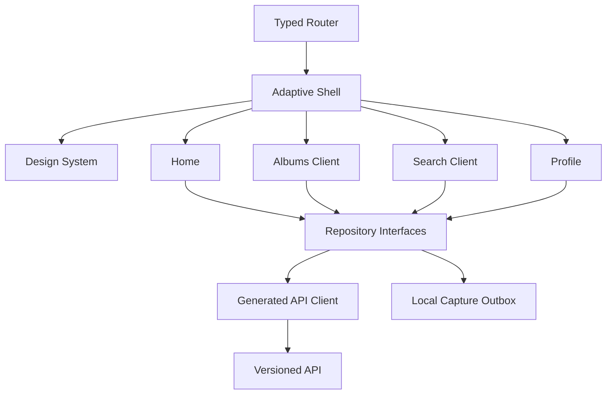

# Design Document: Adaptive Flutter Client and Design System

## Overview

The saveyour.tech client uses Flutter for iOS, Android, and responsive web so visual rendering, motion, semantics, and interaction behavior share one implementation. Its visual reference is neobrutalism.dev: bold contrast, tactile bordered surfaces, hard shadows, playful utility, and direct interaction feedback, adapted into saveyour.tech's emerald palette and content model. Platform adaptation is handled by width, input capability, safe areas, keyboard presence, and navigation conventions rather than by duplicating feature screens.

The client is contract-first. Generated OpenAPI types and repository interfaces are the only data boundary. Every feature has mock repositories and fixture states so this workstream can be developed and tested independently of backend completion.

## Architecture



## Components and Interfaces

### App shell

`AppRouter` owns deep links, authentication guards, public-link routes, and focus restoration. `AdaptiveShell` selects bottom navigation below the compact breakpoint and a navigation rail at wide widths. `SurfaceScaffold` owns safe areas, bounded content width, top bar slots, and keyboard avoidance.

### Repository interfaces

```dart
abstract interface class AppRepository {
  Future<Page<SavedPost>> listPosts(PostQuery query);
  Future<SavedPost> capture(CaptureDraft draft, {required String idempotencyKey});
  Future<PostDetail> getPost(PostId id);
  Future<void> deletePosts(List<PostId> ids);
  Future<SearchPage> search(SearchQuery query);
  Future<List<TagSuggestion>> suggestTags(String query);
  Future<Profile> getProfile();
}
```

`MockAppRepository` returns deterministic fixtures for every state. `HttpAppRepository` maps generated DTOs to domain models and maps problem details to typed failures.

### Design system

Tokens mirror `DESIGN.md`. Primitives expose semantic variants, not arbitrary style overrides. Components include `NeoButton`, `NeoIconButton`, `NeoCard`, `NeoTextField`, `NeoChip`, `NeoBadge`, `NeoSheet`, `NeoDialog`, `NeoSkeleton`, `NeoEmptyState`, `NeoErrorState`, `NeoLoadingStatus`, `NeoSelectionBar`, and `NeoExternalLink`.

### Home and post detail

`HomeController` owns cursor state, retry state, selection set, deletion confirmation, and capture entry. `StaggeredPostGallery` renders media ratios with clamped geometry. `PostCardSemantics` constructs an accessible name from source, title/excerpt, analysis state, and actions. `PostDetailSurface` uses a bottom sheet on compact layouts and modal/inspector composition on wide layouts.

### Search and profile

`SearchController` owns query, filters, suggestions, cursor, result state, and create-album handoff. `ProfileController` owns sign-out, export status, deletion confirmation, and privacy settings.

### Offline outbox

`CaptureOutbox` persists drafts, idempotency keys, retry count, validation status, and server reconciliation. It never reports a mutation as completed before server acknowledgement.

## Data Models

```dart
sealed class LoadState<T> {}
class Loading<T> extends LoadState<T> {}
class Ready<T> extends LoadState<T> { final T value; }
class Partial<T> extends LoadState<T> { final T value; final String message; }
class Failed<T> extends LoadState<T> { final AppFailure failure; final T? staleValue; }

class CaptureDraft {
  final String rawUrl;
  final DateTime createdAt;
  final String idempotencyKey;
}
```

All IDs are opaque. Generated fields are labeled in UI models. Cursor values remain opaque and are never parsed in client feature code.

## Error Handling

- Authentication failures preserve drafts and return to sign-in.
- Validation failures remain attached to the relevant field.
- Network failures preserve loaded data and expose retry.
- Partial analysis is rendered as useful content plus a clear status.
- Destructive operations require confirmation and support undo only where server semantics permit it.
- Unknown API errors become safe, request-ID-bearing messages.

## Testing Strategy

- Unit tests for state reducers, repository mapping, outbox reconciliation, route parsing, breakpoints, and semantic labels.
- Widget tests for every loading/empty/partial/error/success state.
- Golden tests at 320, 390, 480, 768, 1024, and 1440 widths.
- Integration tests for share intent, capture, selection, add-to-album handoff, deletion, search, deep links, and public album routes.
- Accessibility tests for semantics, keyboard traversal, focus restoration, 44px targets, reduced motion, and non-gesture alternatives.

## Performance Considerations

Lazy gallery decoding, thumbnail dimensions, bounded prefetch, request cancellation, debounced suggestions, and stable skeleton geometry prevent scroll jank. Detail media is loaded at display resolution and video playback is deferred until user intent.

## Security Considerations

Tokens use platform secure storage or secure web cookies. The client never receives object-store credentials and only renders authorized media URLs. Source text and generated text are treated as untrusted content and are escaped on web.

## Dependencies

Flutter stable, typed routing, selected state-management library, generated OpenAPI client, secure storage, share-intent integration, SVG/icon support, media rendering, Flutter test/golden tooling, and a maintained Mingcute filled icon asset set.
