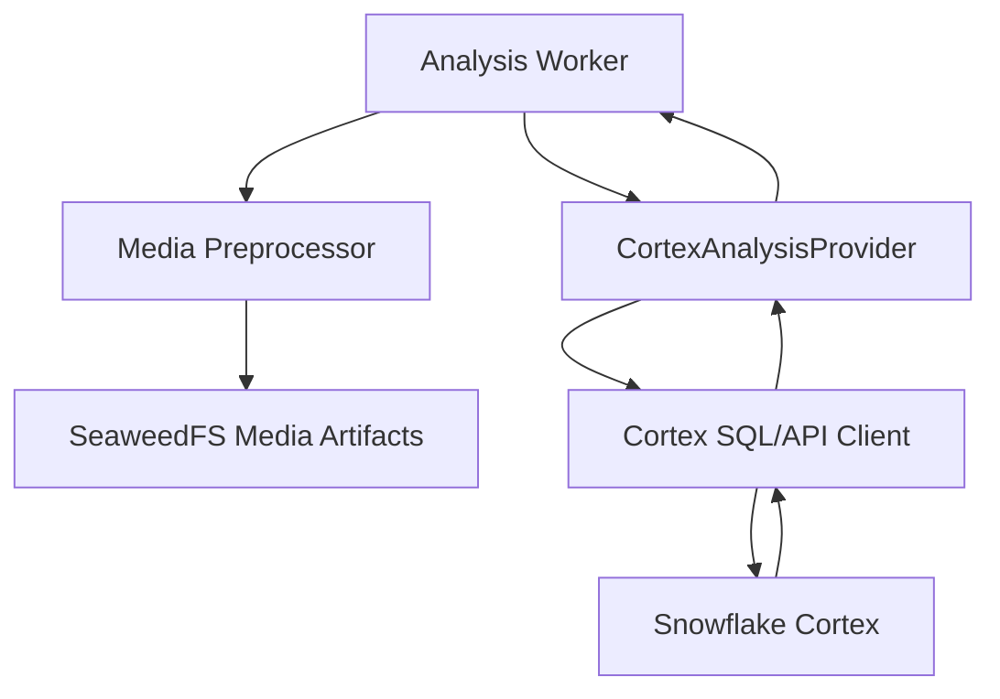

# Design Document: Snowflake Cortex Media Analysis

## Overview

This specification defines the Snowflake Cortex-only AI analysis subsystem for saveyour.tech. It covers image analysis, representative video-frame analysis, captions, tags, summaries, text and multimodal embeddings, and audio transcription through Snowflake Cortex `AI_TRANSCRIBE`.

This subsystem is intentionally independent of TiDB persistence and the application integration coordinator. It exposes typed provider interfaces and versioned result envelopes. A separate integration specification consumes those results and persists them. This subsystem owns Cortex credentials, SQL/API invocation, media-input validation, prompt versions, response normalization, capability checks, bounded retries, and provider tests. It does not own database schemas, repository implementations, queue topology, API routes, or search ranking.

## Architecture



### Scope boundary

**Included:** Cortex client, Cortex capability checks, image/frame analysis, `AI_TRANSCRIBE`, embeddings, response schemas, provider errors, retry policy, prompt versions, fixture tests, approved live Cortex tests.

**Excluded:** database schemas and repositories, data migration, search replacement, Redis queue behavior, API routes, worker lease implementation, SeaweedFS implementation, and final result persistence.

## Components and Interfaces

```pascal
INTERFACE CortexClient
  executeFunction(functionName: String, arguments: List<Value>): Promise<ScalarOrStructuredValue>
  health(): Promise<HealthStatus>
END INTERFACE

INTERFACE CortexAnalysisProvider
  analyzeImage(input: ImageAnalysisInput): Promise<ImageAnalysisResult>
  analyzeFrame(input: FrameAnalysisInput): Promise<FrameAnalysisResult>
  transcribeAudio(input: AudioTranscriptionInput): Promise<TranscriptResult>
  generateTextEmbedding(input: EmbeddingInput): Promise<EmbeddingResult>
  generateMultimodalEmbedding(input: MultimodalEmbeddingInput): Promise<EmbeddingResult>
  checkCapabilities(): Promise<CortexCapabilities>
END INTERFACE

INTERFACE MediaInputValidator
  validateImage(input: ImageAnalysisInput): Promise<Void>
  validateFrame(input: FrameAnalysisInput): Promise<Void>
  validateAudio(input: AudioTranscriptionInput): Promise<Void>
END INTERFACE
```

### CortexClient responsibilities

- Establish authenticated Snowflake sessions or API requests.
- Bind all function parameters safely.
- Apply connection and query timeouts.
- Classify authentication, authorization, throttling, timeout, network, capability, and provider errors.
- Redact credentials, signed URLs, and media payloads from diagnostics.
- Invoke `AI_TRANSCRIBE` exactly as supported by the target Snowflake account.

### CortexAnalysisProvider responsibilities

- Validate media metadata before invocation.
- Select stable prompt-template versions.
- Request structured output.
- Parse and validate response schemas.
- Normalize provider-specific outputs into stable application-neutral types.
- Return model and provider metadata.
- Apply bounded retry policy only to transient failures.
- Never fall back to another transcription provider.

## Data Models

```pascal
STRUCTURE ImageAnalysisInput
  artifactUri: String
  contentType: String
  sizeBytes: Integer
  ownerId: UUID
  postId: UUID
  promptVersion: String
END STRUCTURE

STRUCTURE FrameAnalysisInput
  mediaAssetId: UUID
  frames: List<FrameInput>
  promptVersion: String
END STRUCTURE

STRUCTURE FrameInput
  artifactUri: String
  timestampMs: Integer
  contentType: String
  sizeBytes: Integer
END STRUCTURE

STRUCTURE AudioTranscriptionInput
  artifactUri: String
  contentType: String
  sizeBytes: Integer
  durationMs: Integer OR NULL
  languageHint: String OR NULL
END STRUCTURE

STRUCTURE ImageAnalysisResult
  caption: String OR NULL
  tags: List<TagResult>
  observations: List<Observation>
  warnings: List<String>
  provider: String
  model: String
  modelVersion: String OR NULL
END STRUCTURE

STRUCTURE FrameAnalysisResult
  frames: List<FrameResult>
  aggregateDescription: String OR NULL
  warnings: List<String>
  provider: String
  model: String
END STRUCTURE

STRUCTURE TranscriptResult
  language: String OR NULL
  text: String
  segments: List<TranscriptSegment>
  provider: String
  model: String
  rawProviderResult: JSON OR NULL
END STRUCTURE

STRUCTURE TranscriptSegment
  sequence: Integer
  startMs: Integer
  endMs: Integer
  text: String
  confidence: Decimal OR NULL
END STRUCTURE

STRUCTURE EmbeddingResult
  entityType: String
  entityId: UUID
  model: String
  modelVersion: String OR NULL
  dimensions: Integer
  vector: List<Decimal>
END STRUCTURE
```

## Cortex operations

### Image analysis

1. Validate content type, byte size, owner-scoped artifact access, and prompt version.
2. Invoke Cortex with a structured output schema.
3. Validate caption, tags, observations, warnings, and model metadata.
4. Return a normalized `ImageAnalysisResult`.

### Video-frame analysis

1. Accept only frames selected by the upstream deterministic frame policy.
2. Validate timestamps are nonnegative and ordered.
3. Enforce maximum frame count and payload size.
4. Analyze frames and produce an aggregate description.
5. Preserve frame timestamps in the result.

### Audio transcription

1. Validate normalized audio input.
2. Check cached Cortex transcription capability.
3. Invoke Snowflake Cortex `AI_TRANSCRIBE`.
4. Normalize timestamped or untimestamped output.
5. Preserve bounded, redacted raw output.
6. Return a classified failure if the function is unavailable, unauthorized, unsupported, or malformed.

### Embeddings

1. Normalize source text or approved multimodal input.
2. Invoke the configured Cortex embedding function/model.
3. Validate finite vector values and expected dimension.
4. Return model and dimension metadata.
5. Never silently truncate or pad vectors.

## Error handling

- `CORTEX_CONFIGURATION_ERROR`: invalid credentials, role, warehouse, function permission, or account configuration. Non-retryable until configuration changes.
- `CORTEX_CAPABILITY_ERROR`: required Cortex function/model unavailable. Non-retryable until capability/configuration changes.
- `CORTEX_TRANSIENT_ERROR`: timeout, network error, throttling, or provider-unavailable response. Retry with bounded exponential backoff and jitter.
- `CORTEX_INPUT_ERROR`: unsupported content type, size, duration, inaccessible artifact, or invalid metadata. Retry only after preprocessing changes the input.
- `CORTEX_RESPONSE_ERROR`: malformed or schema-invalid response. Do not mark a stage complete.
- `CORTEX_CONTENT_ERROR`: permanent model/content rejection. Preserve diagnostic category without exposing sensitive content.

## Correctness properties

1. For every accepted transcription result, segment sequence numbers are unique and timestamps are nondecreasing.
2. For every accepted embedding, vector length equals the declared dimension and all values are finite.
3. For every transient Cortex failure, retry count never exceeds configured maximum.
4. For every non-retryable Cortex failure, the provider performs no automatic retry.
5. For every provider response, redacted diagnostics contain no credentials or signed media URLs.
6. For every accepted frame result, output timestamps correspond to input frame timestamps.
7. For every valid result, parsing and serialization preserve all required normalized fields.

## Testing strategy

### Unit tests

- SQL/API function construction.
- Parameter binding.
- Timeout and retry classification.
- Capability cache behavior.
- Image and frame schema validation.
- `AI_TRANSCRIBE` normalization.
- Timestamp and untimestamped transcript handling.
- Embedding dimension validation.
- Prompt-template version selection.
- Secret and URL redaction.

### Contract fixtures

Maintain fixtures for valid and malformed image, frame, transcription, and embedding responses. Include unsupported audio, missing capability, permission failure, throttling, timeout, and empty-transcript cases.

### Integration tests

Run approved live tests against a configured Snowflake account using small fixture images, frames, and audio files. Verify exact `AI_TRANSCRIBE` behavior, supported input references, output shape, timestamps, language, and permissions.

## Performance considerations

- Bound image size, frame count, frame dimensions, audio duration, and request payload size.
- Use per-operation concurrency limits.
- Retry only transient failures.
- Cache capability checks for a bounded interval.
- Keep Cortex calls outside database transactions.
- Record latency and payload-size metrics.

## Security considerations

- Load credentials from secret configuration.
- Use least-privilege Snowflake roles and function access.
- Use short-lived signed URLs or controlled byte transfer.
- Redact secrets, raw media, and signed URLs from logs.
- Enforce owner authorization before creating media input requests.

## Dependencies

- Snowflake account with Cortex enabled.
- Permission to invoke all selected Cortex functions, including `AI_TRANSCRIBE`.
- Snowflake SQL/API client compatible with Bun.
- FFmpeg-normalized media artifacts.
- SeaweedFS or equivalent object references.
- `fast-check` for pure normalization and retry properties.

## Integration contract with other specs

The provider SHALL expose the versioned types consumed by the integration specification. It SHALL return results without assuming TiDB column names or transaction behavior. The integration layer supplies job ID, post ID, media asset ID, idempotency key, and requested stages; the provider returns normalized operation results and classified errors.
