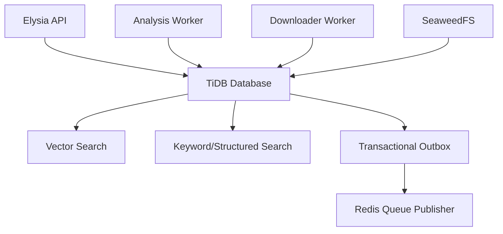

# Design Document: TiDB Application and Search Migration

## Overview

This specification replaces MongoDB persistence and Meilisearch search with TiDB. TiDB becomes the authoritative transactional store for live users, posts, albums, media metadata, analysis state, current AI results, transcripts, tags, embeddings, outbox events, and user-facing hybrid keyword/vector search.

This workstream is independent of Snowflake Cortex implementation. Cortex results enter through the versioned integration contract; TiDB owns schema, transactions, repositories, leases, result persistence, vector storage, search ranking, migration tooling, and cutover. This workstream does not own AI prompts, media preprocessing, Cortex credentials, or provider response parsing.

## Architecture



### Ownership boundaries

**TiDB owns:** current transactional records, relational integrity, current analysis state, active embeddings, search documents, outbox events, migration version, and lease state.

**Outside this workstream:** Cortex invocation and result normalization; FFmpeg and yt-dlp; Redis implementation; SeaweedFS binary storage; API business behavior except wiring; provider prompts and model selection.

## Components and Interfaces

```pascal
INTERFACE TiDBDatabase
  connect(): Promise<Void>
  transaction<T>(operation: Transaction -> Promise<T>): Promise<T>
  query<T>(sql: String, params: List<Value>): Promise<List<T>>
  execute(sql: String, params: List<Value>): Promise<ExecutionResult>
  close(): Promise<Void>
END INTERFACE

INTERFACE TiDBSearchIndex
  upsert(document: SearchDocument): Promise<Void>
  delete(documentId: String): Promise<Void>
  query(request: ScopedSearchRequest): Promise<List<RawSearchHit>>
  rebuild(documents: AsyncIterable<SearchDocument>): Promise<Number>
  health(): Promise<HealthStatus>
END INTERFACE

INTERFACE TiDBMigrationRunner
  migrate(): Promise<MigrationStatus>
  currentVersion(): Promise<String>
  validateCompatibility(): Promise<CompatibilityStatus>
END INTERFACE
```

TiDB repository adapters SHALL implement the existing application contracts for analysis jobs, capture, derived posts, source records, media assets, and outbox records. Repositories SHALL use the shared database adapter and SHALL NOT open independent unmanaged connections.

## Data Models

Required tables:

- `users`
- `posts`
- `albums`
- `album_posts`
- `media_assets`
- `analysis_jobs`
- `analysis_job_stages`
- `analysis_results`
- `transcripts`
- `transcript_segments`
- `tags`
- `post_tags`
- `embeddings`
- `search_documents`
- `processing_attempts`
- `outbox_events`

Required properties:

- Unique analysis idempotency keys.
- Owner indexes on all user-visible records.
- Canonical URL deduplication consistent with current behavior.
- Foreign-key or explicit referential checks for post/media/job relationships.
- Status/time indexes for retryable jobs and outbox events.
- Vector index compatible with selected TiDB version and embedding dimension.
- Unique embedding identity by entity, model, and version.
- Unique outbox event identity.

```pascal
STRUCTURE SearchDocument
  documentId: UUID
  ownerId: UUID
  postId: UUID
  text: String
  tags: List<String>
  platform: String
  mediaKinds: List<String>
  analysisStatus: AnalysisStatus
  activeEmbeddingId: UUID OR NULL
  createdAt: Timestamp
  updatedAt: Timestamp
END STRUCTURE

STRUCTURE EmbeddingRecord
  id: UUID
  entityType: String
  entityId: UUID
  model: String
  modelVersion: String OR NULL
  dimensions: Integer
  vector: List<Decimal>
  active: Boolean
  createdAt: Timestamp
END STRUCTURE
```

## Transactions and consistency

### Capture transaction

One TiDB transaction inserts the post, idempotency record, media metadata, analysis job, and initial outbox event. The API acknowledges capture only after commit.

### Analysis result transaction

One TiDB transaction inserts normalized current results, transcript rows, embedding versions, active search document, completed stage state, and completion outbox event. External Cortex calls occur before this transaction.

### Lease transaction

Job claiming uses an atomic conditional update based on status and lease expiry. Stage updates include lease owner/version predicates so stale workers cannot commit.

### Outbox

Outbox events are inserted in the same transaction as the state change. A separate publisher claims, publishes, retries, and dead-letters events idempotently.

## Hybrid search

TiDB search applies owner and structured filters first, then keyword matching and vector similarity. Application-controlled ranking combines normalized keyword and vector scores with deterministic tie-breaking. Query and document embeddings must use the same model and dimension.

Search operations:

- `upsert`: insert or replace the active search document and embedding reference.
- `delete`: remove the active search document while retaining analysis history.
- `query`: apply owner scope, structured filters, keyword matching, vector similarity, score combination, and pagination.
- `rebuild`: derive active documents from TiDB source records and converge to the same active set as incremental indexing.
- `health`: verify connection, schema, vector configuration, and query capability.

## Migration and cutover

1. Export MongoDB collections with source metadata.
2. Transform nested documents into relational rows.
3. Load in dependency order with deterministic ID mappings.
4. Quarantine malformed records rather than silently dropping them.
5. Validate counts, owners, relationships, statuses, timestamps, payload samples, and search documents.
6. Rebuild active embeddings through the Cortex workstream or a controlled batch command.
7. Run shadow reads and search comparisons.
8. Promote TiDB reads and search only after validation gates pass.
9. Preserve rollback snapshots until the observation period ends.
10. Remove MongoDB and Meilisearch only after rollback retention expires.

## Error handling

- Transaction conflicts roll back and retry only when classified transient.
- Duplicate keys use idempotent compare-and-return behavior.
- Vector dimension mismatches reject writes before persistence.
- Referential violations fail the transaction and produce migration diagnostics.
- Missing source records are quarantined during migration.
- Stale lease updates affect zero rows and return a stale-worker error.
- Outbox publication failure leaves the event durable and retryable.

## Correctness properties

1. Repeating a capture with the same owner and idempotency key creates at most one logical capture.
2. Every committed state change requiring publication has one durable outbox identity.
3. Every user search result belongs to the requested owner.
4. Every stored vector has the configured dimension and model compatibility.
5. Replaying a result transaction with the same idempotency key creates no duplicates.
6. A stale worker cannot update a job after lease ownership changes.
7. Incremental search indexing and full rebuild converge to the same active document set.
8. Migration reruns do not duplicate rows and produce the same target state.

## Testing strategy

- Migration tests for empty install, upgrade, constraints, indexes, and vector configuration.
- Repository contract tests with representative records and transaction failures.
- Lease and stale-worker tests.
- Outbox claim/retry/dead-letter tests.
- Vector search tests with filters, owner isolation, dimensions, deletion, and rebuild.
- Migration fixture tests for nested documents, missing fields, invalid dates, duplicate keys, and quarantine.
- Integration tests use a fake Cortex provider and do not require Snowflake.

## Performance considerations

- Index owner/filter columns before vector ranking.
- Use bounded result limits and keyset pagination where supported.
- Use connection pooling and prepared statements.
- Keep large binary media outside TiDB.
- Keep historical embeddings out of the active search index.
- Use indexed status/time windows for retry and outbox polling.

## Security considerations

- Parameterize every SQL statement.
- Enforce owner filtering in SQL and service mapping.
- Restrict TiDB credentials to required schemas and operations.
- Store only media references, checksums, and metadata in TiDB.
- Audit migration and cutover operations.

## Dependencies

- Selected TiDB version/deployment with required vector and text-search capabilities.
- TiDB-compatible TypeScript/Bun client.
- Existing domain contracts.
- Redis for outbox publication and queues.
- SeaweedFS for object storage.
- Migration tooling for MongoDB export and transformation.

## Integration contract with other specs

TiDB accepts normalized `AnalysisResultEnvelope` records from the integration specification. TiDB does not parse provider-specific Cortex responses. Embedding rows require model, version, dimension, vector, entity identity, and active/version metadata supplied by the integration layer.
